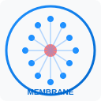

# ContextPack + Context Harness + Membrane

<p align="center">
  
</p>

[License: MIT](LICENSE)
[Python 3.11+](https://www.python.org/downloads/)
[Version](pyproject.toml)

**ContextPack** is a universal AI context runtime — graph-native code understanding, compression, and multi-source harvesting for any repository.

**Context Harness** is the workflow layer on top: Cursor/Claude hooks, MCP tools, skills, and doc/graph validation — a closed loop between *how agents work* and *what they see*. Phases 6–9 extend the harness with deterministic skill gates, semantic contract verification, trust-aware context compilation, and adaptive self-improvement.

**Membrane** is the VS Code extension that brings the full harness into your editor — interactive dependency graphs, @membrane chat, real-time skill gate diagnostics, context debt dashboards, and agent conflict monitoring, all powered by the same Python backend.

See [HARNESS.md](HARNESS.md) for the full backend architecture.
See [membrane-vscode/DEVELOPMENT.md](membrane-vscode/DEVELOPMENT.md) for the extension architecture.

---

## Membrane — VS Code Extension

Install `membrane-vscode-0.1.0.vsix` via **Extensions → Install from VSIX** (or `code --install-extension membrane-vscode/membrane-vscode-0.1.0.vsix`).

### Features

**Graph Panel — Interactive Dependency Graph**

`Cmd+Shift+M G` opens a full-screen force-directed graph powered by vis.js:
- Hub nodes highlighted in red (high connectivity), modules in blue
- Left sidebar: search, layout selector (force / hierarchical / circular), type filter, zoom controls
- Click any node → slide-in info panel showing name, type, file path, connection count + **Open in Editor** button
- Empty state links to Build Index; loading spinner during data fetch

**@membrane Chat Participant**

Use `@membrane` in VS Code Chat (requires VS Code ≥ 1.90):
```
@membrane status          → index summary: entities, files, hubs
@membrane debt            → context debt table with trend arrows
@membrane conflicts       → active agent locks
@membrane patterns        → recurring failure pattern briefing
@membrane trust           → low-trust file report
@membrane <anything>      → free-form harvest query
```

**Context Debt Dashboard**

`Cmd+Shift+P → Membrane: Open Context Debt Dashboard` opens a WebView with:
- Color-coded bar chart (red ≥ 70, orange ≥ 40, green < 40) per module
- Trend arrows (↑ rising, ↓ falling, → stable)
- Summary cards: total modules, critical count, average debt
- Architectural coupling grid (last 30 days)

**Skill Gate Diagnostics**

Skill gates run automatically on file save — violations appear as red squiggles in the Problems panel alongside normal TypeScript/Python errors. `Cmd+Shift+P → Membrane: Run Skill Gates on Changed Files` runs gates across all git-modified files at once.

**Sidebar Tree Views**

Seven live tree views in the Membrane activity bar panel:

| View | What it shows |
|------|---------------|
| Symbol Explorer | Classes, functions, modules from the index |
| Context Debt | Modules ranked by debt score (CRITICAL / HIGH / normal) |
| Skill Gates | Pass/fail per gate with blast radius in tooltip |
| Agent Locks | Active file locks per agent ID |
| Failure Patterns | Grouped by severity (High / Medium / Low) |
| Trust Scores | Files at T4–T5 (low trust) surfaced for review |
| Playbook Proposals | Auto-proposed `skills.yml` entries from evidence bundles |

**Status Bar**

Two persistent status bar items (bottom bar):
- `$(shield) Membrane: ready` — extension state with click-to-recover quick pick
- `$(lock) N conflicts` — live agent conflict count (polls every 30 s), hidden when 0

**Setup Wizard**

First run opens an interactive wizard that detects uv, installs contextpack, initializes the workspace index, and configures `.mcp.json` — no terminal required.

### Settings

| Setting | Default | Description |
|---------|---------|-------------|
| `membrane.embeddingProvider` | `hash` | `hash` (local, no API key), `openai`, `azure_foundry` |
| `membrane.llmProvider` | `` | Optional LLM for ask/harvest: `openai` or `azure_foundry` |
| `membrane.openaiApiKey` | `` | OpenAI API key |
| `membrane.azureEndpoint` | `` | Azure OpenAI endpoint URL |
| `membrane.azureDeployment` | `` | Azure chat deployment name |
| `membrane.azureEmbeddingDeployment` | `` | Azure embedding deployment name |
| `membrane.autoWatch` | `true` | Auto-watch files and trigger incremental builds |
| `membrane.autoMcpConfigure` | `true` | Auto-write `.mcp.json` on activation |
| `membrane.maxEmbedEntities` | `2000` | Cap on embedded entities (rest stored-only) |

### Extension Architecture

```
membrane-vscode/
├── src/
│   ├── extension.ts           ← activation lifecycle (uv → install → verify → wire)
│   ├── chatParticipant.ts     ← @membrane chat routing
│   ├── statusBar.ts           ← two-item status bar + conflict polling
│   ├── diagnostics/
│   │   └── skillGateDiagnostics.ts  ← Problems panel integration
│   ├── panels/
│   │   ├── GraphPanel.ts      ← vis.js dependency graph WebView
│   │   ├── DebtDashboard.ts   ← context debt bar chart WebView
│   │   ├── HarvestPanel.ts    ← free-form harvest query WebView
│   │   └── WizardPanel.ts     ← first-run setup wizard WebView
│   ├── providers/             ← 7 TreeDataProviders (sidebar views)
│   ├── commands/              ← build, harvest, skill, governance, setup
│   ├── python/                ← uv detector, installer, runner (subprocess)
│   ├── build/                 ← BuildService (incremental + full build)
│   ├── mcp/                   ← McpServerManager (stdio MCP process)
│   └── watcher/               ← FileWatcherManager (glob → incremental build)
└── webview-src/
    ├── graph/index.html        ← vis.js graph (full inline JS, CSP nonce)
    ├── harvest/                ← harvest query UI
    └── wizard/                 ← setup wizard UI
```

---

## How it works

ContextPack harvests **parallel context sources** and aggregates them into one agent-ready pack:


| Source         | Fetcher                    | What you get                            |
| -------------- | -------------------------- | --------------------------------------- |
| Code           | `CodeContextFetcher`       | Call graphs, symbols, cross-module deps |
| Guidelines     | `ProductGuidelinesFetcher` | `.pr-review/guidelines.md`, `AGENTS.md` |
| Test behaviour | `TestBehaviourFetcher`     | Expected behaviour names from tests     |
| Product intent | `JiraIntentFetcher`        | Ticket AC & description (optional)      |


The **Context Aggregator** merges these into an `<extra_instructions>` block ready for Claude, OpenAI, Cursor, or LangGraph.

---

## Install

```bash
git clone git@github.com:NANDISHSHAH/contextharness.git
cd contextharness

uv sync
uv pip install -e .

# Verify
python -c "from contextpack import Project; print('ok')"
```

> **Optional extras**
>
> - `uv sync --extra harness` — MCP server for Cursor / Claude
> - `uv sync --extra chroma` — ChromaDB vector store (default is SQLite, no extra needed)
> - `uv sync --extra dev` — tests, linting, MkDocs

### Run `context` from anywhere (Optional)

To use the `context` command from any directory without `uv run`, add this alias to your shell config:

**For bash** (`~/.bashrc`):
```bash
alias context='(cd /path/to/contextharness && uv run context)'
```

**For zsh** (`~/.zshrc`):
```bash
alias context='(cd /path/to/contextharness && uv run context)'
```

Then reload your shell:
```bash
source ~/.bashrc  # or source ~/.zshrc
```

Now you can run `context` from any directory:
```bash
context init /path/to/any/repo
context build /path/to/any/repo --vibe
```

---

## Quick start (CLI)

```bash
context init ./my-repo
context build ./my-repo           # plain summary table
context build ./my-repo --vibe    # animated Pac-Man display + token/cost footer
context harvest "review upload pipeline" ./my-repo
context harness orient    # session briefing
context harness validate  # check AGENTS.md vs graph hubs
```

```bash
context ask "How does authentication work?" ./my-repo
context ask "Explain auth" ./my-repo --vibe   # thinking spinner + token trace
context ask "Explain auth" ./my-repo --llm    # uses Azure Foundry / OpenAI from .env
```

```bash
# Phase 6 — skill gates before edits
context skills plan "src/auth/middleware.py,src/auth/tokens.py" ./my-repo
context skills run  "src/auth/middleware.py" ./my-repo --blast-radius 8

# Phase 7 — semantic contracts
context contracts show validate_token ./my-repo
context contracts check ./my-repo

# Phase 8 — context health
context debt ./my-repo

# Phase 9 — adaptive intelligence
context coupling ./my-repo
context patterns ./my-repo
```

**Cursor:** enable `.mcp.json` → `context-harness` server and drop `.cursor/hooks.json` into your repo for automatic session orientation and stop validation.

---

## CLI reference


| Command                   | Description                                                            |
| ------------------------- | ---------------------------------------------------------------------- |
| `context init`            | Create `.contextpack/` workspace                                       |
| `context build`           | Scan → parse → graph → embed → index + extract workflows               |
| `context build --vibe`    | Same, with animated Pac-Man display and token/cost summary             |
| `context harvest`         | Multi-source context aggregation                                       |
| `context ask`             | Answer a question using harvested context                              |
| `context ask --vibe`      | Same, with thinking spinner and token trace panel                      |
| `context graph`           | Show a graph excerpt                                                   |
| `context watch`           | Watch for changes and rebuild incrementally                            |
| `context changes`         | Show file changes from incremental builds                              |
| `context workflows`       | List workflows extracted from the codebase                             |
| `context skills plan`     | Compute SkillPlan: risk score, policies, required gates *(Phase 6)*    |
| `context skills run`      | Run full gate: route → enforce → execute → record evidence *(Phase 6)* |
| `context skills history`  | Evidence bundle audit trail *(Phase 6)*                                |
| `context contracts show`  | Show extracted contracts for a symbol *(Phase 7)*                      |
| `context contracts check` | Validate invariants.yml rules against codebase *(Phase 7)*             |
| `context debt`            | Per-module context debt report *(Phase 8)*                             |
| `context locks`           | Active agent file locks / conflict table *(Phase 8)*                   |
| `context patterns`        | Recurring skill failure patterns with proactive hints *(Phase 9)*      |
| `context coupling`        | Architectural coupling trend (last 30 days) *(Phase 9)*                |
| `context snapshots`       | List / diff semantic state snapshots *(Phase 9)*                       |
| `context graphify`        | Export self-contained vis.js dependency graph HTML *(Extension)*       |


---

## Python SDK

```python
import asyncio
from contextpack import Project

async def main():
    project = Project("./repo")
    await project.init()
    await project.build()

    # Full agent context: code + guidelines + tests + optional Jira
    agent_ctx = await project.harvest(
        "Explain upload pipeline",
        branch_name="feature/PROJ-123-upload",
    )
    print(agent_ctx.extra_instructions)

    # Offline answer — no cloud API required
    print(await project.ask("How does authentication work?"))

asyncio.run(main())
```

Runnable examples: `[examples/README.md](examples/README.md)`

```bash
python examples/01_basic_package_usage.py      # no API key needed
python examples/02_azure_foundry_agent.py      # requires Azure Foundry env vars
python examples/03_incremental_watch.py        # incremental builds + change log
python examples/04_workflows_agent_memory.py   # workflow extraction + shared memory
python examples/05_skill_engine.py             # Phase 6 — skill gates (no API key)
python examples/06_contracts.py                # Phase 7 — semantic contracts
python examples/07_governance.py               # Phase 8 — trust, debt, locks
python examples/08_adaptive.py                 # Phase 9 — failure patterns, coupling, playbook
```

### Phase 6 — skill gate before an edit

```python
from contextpack.skills import SkillManifest, SkillVerifierLoop
from pathlib import Path

manifest = SkillManifest.load(Path("./my-repo"))
loop = SkillVerifierLoop(Path(".contextpack/memory.db"))

result = await loop.verify(
    changed_files=["src/auth/middleware.py"],
    repo_path=Path("./my-repo"),
    manifest=manifest,
    blast_radius=12,
    hub_centralities={"src/auth/middleware.py": 0.91},
    agent_id="my_agent",
)
print(result.to_text())
# ✅ ALLOWED  risk: 0.73  blast_radius: 12
# Evidence bundle: act_8f3k2
```

### Phase 7 — semantic contracts

```python
from contextpack.contracts import ContractExtractor, IntentPreserver
from pathlib import Path

# Extract contracts from AST
extractor = ContractExtractor()
contracts = extractor.extract_from_file(
    Path("src/auth/tokens.py"),
    Path("src/auth/tokens.py").read_text(),
)
# → preconditions, postconditions, raises, trust_score per symbol

# Check a proposed patch against test-inferred invariants
preserver = IntentPreserver()
invariants = preserver.extract_invariants(list(Path("tests/").rglob("test_*.py")))
result = preserver.check_preserved(invariants, proposed_code, "validate_token")
print(result.ok, result.violations)
```

### Phase 8 — trust-aware context

```python
from contextpack.governance import TrustScorer, AgentLockTable

# Score context chunks by source trust tier
scorer = TrustScorer()
score = scorer.score_chunk("test", "tests/test_auth.py", days_since_modified=2, ci_verified=True, test_coverage=0.94)
print(score.label, score.score)   # T1:GroundTruth  1.0

# Multi-agent conflict detection
locks = AgentLockTable(Path(".contextpack/memory.db"))
await locks.acquire("agent_a", files=["src/auth/tokens.py"])
conflict = await locks.check_conflicts("agent_b", files=["src/auth/tokens.py"], symbols=[])
print(conflict.to_text())
```

### Phase 9 — adaptive intelligence

```python
from contextpack.adaptive import FailurePatternStore, PlaybookLearner, CouplingMonitor

# Proactive failure briefing
store = FailurePatternStore(Path(".contextpack/memory.db"))
patterns = await store.list_proactive("src/auth/middleware.py")
for p in patterns:
    print(p.to_briefing())

# Auto-propose skills.yml entries from evidence
learner = PlaybookLearner()
proposals = learner.propose([b.model_dump() for b in bundles])
print(learner.format_proposals(proposals))

# Architectural coupling decay
monitor = CouplingMonitor(Path(".contextpack/memory.db"))
trend = await monitor.trend(days=30)
print(trend.to_text())
```

---

## Azure AI Foundry

Use a model deployed in **Azure AI Foundry**. Copy the endpoint, key, and deployment name from **Foundry → Deployments**.

```env
CONTEXTPACK_LLM_PROVIDER=azure_foundry
AZURE_OPENAI_ENDPOINT=https://<resource>.openai.azure.com/
AZURE_OPENAI_API_KEY=<key>
AZURE_OPENAI_DEPLOYMENT=<deployment-name>

# Optional: embeddings from the same Foundry resource
CONTEXTPACK_EMBEDDING_PROVIDER=azure_foundry
AZURE_OPENAI_EMBEDDING_DEPLOYMENT=text-embedding-3-small
```

```python
from contextpack.llm import AzureFoundryLLM
from contextpack.adapters import AzureFoundryAdapter

ctx = await project.harvest("How does auth work?")
system, user = AzureFoundryAdapter().build_prompt(ctx)
llm = AzureFoundryLLM()
answer = await llm.complete(system, f"{user}\n\nQuestion: How does auth work?")
```

Some Foundry setups use an inference project URL (`*.services.ai.azure.com`) instead of the OpenAI-compatible endpoint:

```env
AZURE_USE_INFERENCE_ENDPOINT=true
AZURE_AI_INFERENCE_ENDPOINT=https://<project>.services.ai.azure.com
```

See `[examples/02_azure_foundry_agent.py](examples/02_azure_foundry_agent.py)` for a complete working script.

---

## Architecture

```text
Repository
    │
    ▼
Scanner → Parsers → ContextGraph (NetworkX)
    │                      │
    ▼                      ▼
Chunking → Embeddings → SQLite (default) / ChromaDB (optional)
    │
    ▼
HybridRetriever → ContextCompiler (token budget + trust-aware filtering)
    │
    ▼
ContextHarvester (parallel fetchers)
    │
    ▼
ContextAggregator → AggregatedAgentContext
    │
    ▼
Adapters (Claude / OpenAI / Cursor / LangGraph)
    │
    ▼
Context Harness
    ├── Skills Engine  (manifest → router → DAG executor → verifier → evidence)   [Phase 6]
    ├── Contract Layer (extractor → registry → invariant guard → intent preserver) [Phase 7]
    ├── Governance     (trust tiers → debt scores → provenance chains → locks)     [Phase 8]
    └── Adaptive       (failure patterns → coupling monitor → playbook learner)    [Phase 9]
```

---

## Configuration

Copy `.env.example` to `.env` and set the relevant keys:


| Variable                         | Purpose                                               |
| -------------------------------- | ----------------------------------------------------- |
| `CONTEXTPACK_LLM_PROVIDER`       | `azure_foundry` or `openai`                           |
| `AZURE_OPENAI_*`                 | Endpoint, key, deployment from Azure AI Foundry       |
| `CONTEXTPACK_EMBEDDING_PROVIDER` | `hash` (local, default), `azure_foundry`, or `openai` |
| `CONTEXTPACK_VECTOR_STORE`       | `sqlite` (default) or `chroma`                        |
| `JIRA_*`                         | Optional — product intent from Jira tickets           |


---

## Team guidelines

Place domain rules for agents in any of these files; ContextPack picks them up automatically:

```
.pr-review/guidelines.md
.contextpack/guidelines.md
AGENTS.md
```

If none are present, guideline-based checks are skipped gracefully.

For skill policies and architectural invariants:

```
.contextpack/skills.yml      ← which gates run on which files (Phase 6)
.contextpack/invariants.yml  ← architectural rules: no_direct_import, no_cycles (Phase 7)
```

---

## Demo

Run the tiny-api sample app (builds in under a second):

```bash
chmod +x demo/scripts/*.sh
./demo/scripts/demo-01-setup.sh    # install harness on tiny-api
./demo/scripts/demo-02-build.sh    # build index with timing
./demo/scripts/demo-03-harvest.sh "review auth and billing"
```

- [demo/USER-JOURNEY.md](demo/USER-JOURNEY.md) — visual walkthrough with Mermaid flows
- [demo/tiny-api/](demo/tiny-api/) — the sample app

---

## Documentation

Full product and architecture docs (MkDocs):

```bash
uv sync --extra dev
mkdocs serve
```

Open [http://127.0.0.1:8000](http://127.0.0.1:8000) or read directly in `[docs/](docs/index.md)`.

Key guides:


| Guide                                                             | What you learn                                   |
| ----------------------------------------------------------------- | ------------------------------------------------ |
| [Getting started](docs/guides/getting-started.md)                 | Install, first build, first harvest              |
| [Build performance](docs/guides/build-performance.md)             | Tiered embedding, skip patterns, timing          |
| [Incremental builds](docs/guides/incremental-builds.md)           | File-hash delta, watch mode, change log          |
| [Workflows & agent memory](docs/guides/workflows-agent-memory.md) | Call chain extraction, per-agent + shared memory |
| [Context Harness](docs/guides/context-harness.md)                 | Hooks, MCP, skills, validation                   |
| [Azure AI Foundry](docs/guides/azure-foundry.md)                  | On-prem/VNet setup                               |
| [Architecture overview](docs/architecture/overview.md)            | Full system design                               |
| [Next phases plan](docs/product/PLAN_NEXT_PHASES.md)              | Phases 6–9 design & research backing             |


---

## Development

```bash
uv sync --extra dev
pytest
ruff check contextpack tests
mypy contextpack
```

---

## Roadmap


| Phase | Status | Scope                                                                                                 |
| ----- | ------ | ----------------------------------------------------------------------------------------------------- |
| 1     | Done   | Scanner, parser, graph, embeddings, retrieval                                                         |
| 2     | Done   | Compiler, harvester, aggregator                                                                       |
| 3     | Done   | Incremental watch mode, file-hash delta tracking, git-diff change log                                 |
| 4     | Done   | Context Harness — hooks, MCP, skills, validate                                                        |
| 5     | Done   | WorkflowExtractor (call chains, API surface, class lifecycles), multi-agent shared memory             |
| 6     | Done   | Pre-Skill Engine — skill manifest, router, DAG executor, blast radius enforcement, evidence audit     |
| 7     | Done   | Semantic Contract Layer — AST extraction, registry, invariant guard, intent preserver, anti-patterns  |
| 8     | Done   | Context Governance & Trust — 5-tier scoring, debt tracker, provenance chains, agent lock table        |
| 9     | Done   | Adaptive Intelligence — failure pattern memory, coupling monitor, context snapshots, playbook learner |
| VS Code | Done | Membrane extension — graph panel, @membrane chat, debt dashboard, skill diagnostics, sidebar views   |


---

## License

MIT — see [LICENSE](LICENSE).