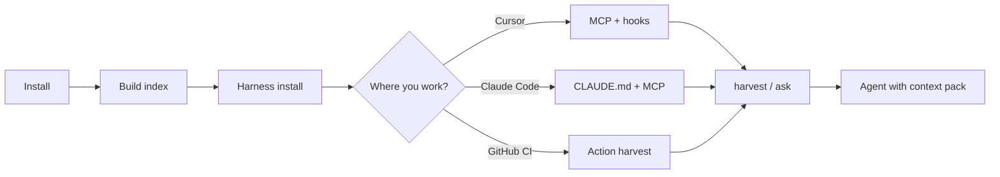
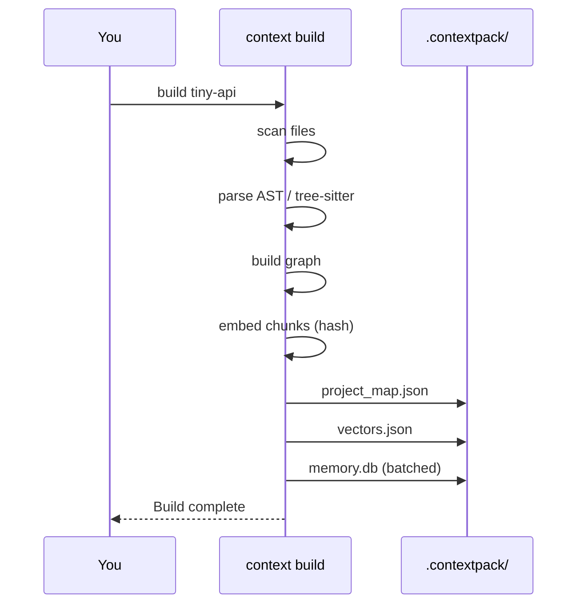
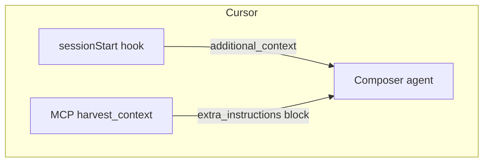

# Context Harness — user journey

A visual walkthrough: from zero to an agent that sees your code **and** your team rules.

Use the **tiny-api** demo (`demo/tiny-api/`) so builds finish in seconds, then apply the same steps to your real repo.

---

## Journey map



---

## Phase 0 — Why does `.contextpack/` feel slow?

`context build` creates several artifacts, not only `memory.db`:

| Artifact | What it is | Typical cost |
|----------|------------|--------------|
| `project_map.json` | Scan + parse all source files | Grows with repo size |
| `vectors.json` | Embeddings for hybrid search | One batch (hash = local, fast) |
| `memory.db` | SQLite entity store | **Was slow:** one DB open per entity; **now batched** |
| `config.json` | Git HEAD stamp for staleness | Instant |

**Large repos (e.g. contextharness itself):** parsing ~100 Python files + ~240 entities dominates; expect a few seconds, not minutes.

**If build takes minutes:**

1. Confirm you are **not** using Chroma unless needed: `CONTEXTPACK_VECTOR_STORE=sqlite` (default).
2. Avoid `uv sync --extra chroma` on first run (ONNX cold start).
3. Run with timings: `context build . --timing`
4. Use a small demo first: `context build demo/tiny-api --timing`

See [Build performance](../docs/guides/build-performance.md).

---

## Phase 1 — Install (once per machine)

```bash
git clone https://github.com/NANDISHSHAH/contextharness.git
cd contextharness
uv sync --extra harness
```

| Tool | Command | Purpose |
|------|---------|---------|
| Runtime | `uv sync` | ContextPack + CLI |
| MCP | `--extra harness` | `context-harness-mcp` for Cursor/Claude |

---

## Phase 2 — Build index (per repo)

```bash
./demo/scripts/demo-02-build.sh
```

Equivalent:

```bash
context init demo/tiny-api
context build demo/tiny-api --timing
```



---

## Phase 3 — Install harness (workflow layer)

```bash
./demo/scripts/demo-01-setup.sh
```

Adds to the target repo:

- `.cursor/hooks.json` — session orientation + stop validation
- `.mcp.json` — MCP server config
- `AGENTS.md` — conventions for harvest

---

## Phase 4 — Get context to an LLM

### Option A — Cursor (recommended)

1. Open `contextharness` or `demo/tiny-api` in Cursor.
2. Enable MCP server **context-harness** (from `.mcp.json`).
3. New chat → session hook injects orientation.
4. Ask: *Use `harvest_context` for: review auth and billing*



### Option B — Claude Code / Claude Desktop

1. Copy or symlink `.mcp.json` into the project (or add server in Claude settings).
2. Add `CLAUDE.md` (use `AGENTS.md` as source).
3. Run build + harvest in terminal; paste output, or use MCP tools.

Detailed steps: [Claude integration](../docs/guides/claude-integration.md).

### Option C — GitHub Actions (PR bot)

On each PR: `context build` → `context harvest` → post comment or pass to API.

Detailed steps: [GitHub integration](../docs/guides/github-integration.md).

---

## Phase 5 — Harvest (task-specific pack)

```bash
./demo/scripts/demo-03-harvest.sh "review auth and billing"
```

Output is an `<extra_instructions>` block containing:

- Team guidelines (`.pr-review/guidelines.md`)
- Test behaviour names
- Compiled code summaries
- Optional Jira (if configured)

**Pass to Claude manually:**

```bash
context harvest "your task" demo/tiny-api > /tmp/pack.md
# Paste pack.md into Claude as project context
```

**Pass via API:** use `AggregatedAgentContext.extra_instructions` from the Python SDK — see [package usage](../docs/guides/package-usage.md).

---

## Phase 6 — Validate & maintain

```bash
context harness validate demo/tiny-api
context harness orient demo/tiny-api
```

Stop hook (Cursor) reminds you when `AGENTS.md` drifts from graph hubs.

---

## Cheat sheet

| Goal | Command |
|------|---------|
| Fast learning | `context build demo/tiny-api --timing` |
| Cursor session | hooks auto + MCP `project_outline` |
| Claude paste | `context harvest "…" . > pack.md` |
| PR review | `context harvest "functional review" . --branch feat/x` |
| Check docs | `context harness validate .` |

---

## Next

- [tiny-api README](tiny-api/README.md)
- [Build performance](../docs/guides/build-performance.md)
- [Claude](../docs/guides/claude-integration.md) · [GitHub](../docs/guides/github-integration.md)
