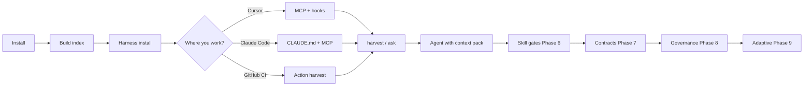
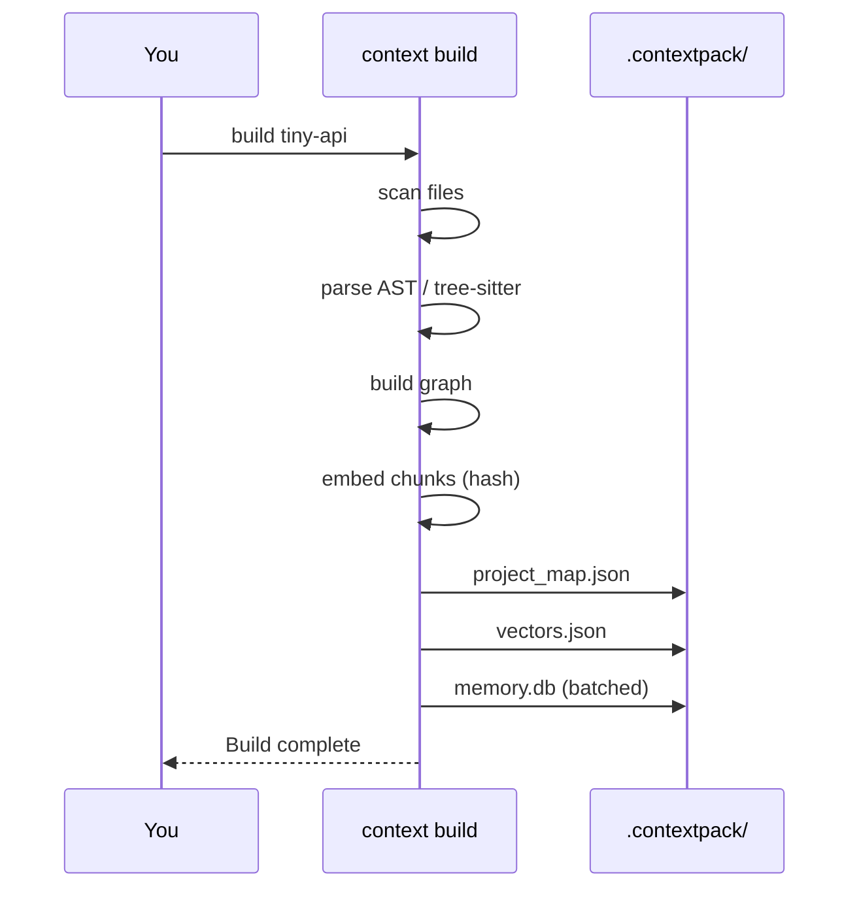
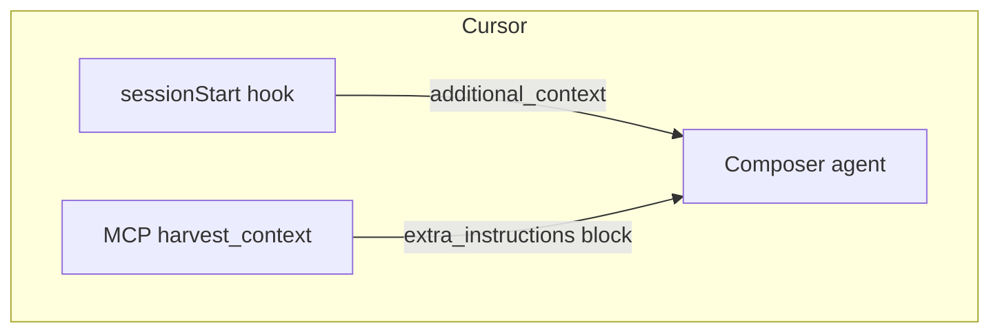
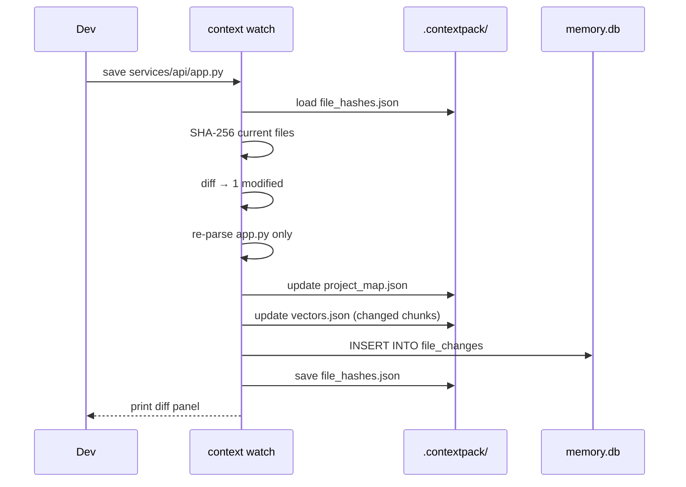
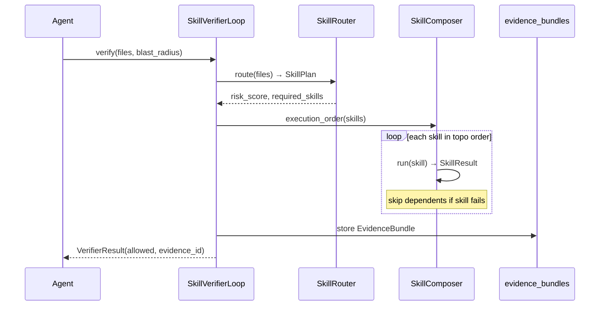
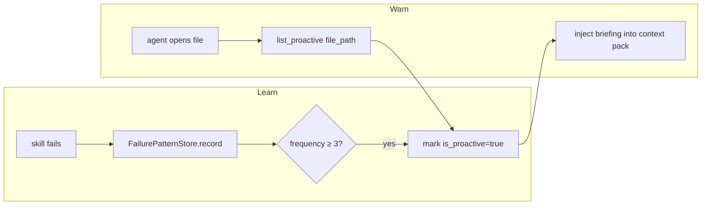

# Context Harness — user journey

A visual walkthrough: from zero to an agent that sees your code **and** your team rules.

Use the **tiny-api** demo (`demo/tiny-api/`) so builds finish in seconds, then apply the same steps to your real repo.

---

## Journey map



---

## Phase 0 — Why does `.contextpack/` feel slow?

`context build` creates several artifacts, not only `memory.db`:

| Artifact | What it is | Typical cost |
|----------|------------|--------------|
| `project_map.json` | Scan + parse all source files | Grows with repo size |
| `vectors.json` | Embeddings for hybrid search | One batch (hash = local, fast) |
| `memory.db` | SQLite entity store | **Was slow:** one DB open per entity; **now batched** |
| `config.json` | Git HEAD stamp for staleness | Instant |

**Large repos (e.g. contextharness itself):** parsing ~100 Python files + ~240 entities dominates; expect a few seconds, not minutes.

**If build takes minutes:**

1. Confirm you are **not** using Chroma unless needed: `CONTEXTPACK_VECTOR_STORE=sqlite` (default).
2. Avoid `uv sync --extra chroma` on first run (ONNX cold start).
3. Run with timings: `context build . --timing`
4. Use a small demo first: `context build demo/tiny-api --timing`

See [Build performance](../docs/guides/build-performance.md).

---

## Phase 1 — Install (once per machine)

```bash
git clone https://github.com/NANDISHSHAH/contextharness.git
cd contextharness
uv sync --extra harness   # includes MCP server AND ruff for skill gates
```

| Tool | Command | Purpose |
|------|---------|---------|
| Runtime | `uv sync` | ContextPack + CLI |
| MCP + skills | `--extra harness` | `context-harness-mcp` + ruff lint gate |

---

## Phase 2 — Build index (per repo)

```bash
./demo/scripts/demo-02-build.sh
```

Equivalent:

```bash
context init demo/tiny-api
context build demo/tiny-api --timing
```



---

## Phase 3 — Install harness (workflow layer)

```bash
./demo/scripts/demo-01-setup.sh
```

Adds to the target repo:

- `.cursor/hooks.json` — session orientation + stop validation
- `.mcp.json` — MCP server config
- `AGENTS.md` — conventions for harvest

---

## Phase 4 — Get context to an LLM

### Option A — Cursor (recommended)

1. Open `contextharness` or `demo/tiny-api` in Cursor.
2. Enable MCP server **context-harness** (from `.mcp.json`).
3. New chat → session hook injects orientation.
4. Ask: *Use `harvest_context` for: review auth and billing*



### Option B — Claude Code / Claude Desktop

1. Copy or symlink `.mcp.json` into the project (or add server in Claude settings).
2. Add `CLAUDE.md` (use `AGENTS.md` as source).
3. Run build + harvest in terminal; paste output, or use MCP tools.

Detailed steps: [Claude integration](../docs/guides/claude-integration.md).

### Option C — GitHub Actions (PR bot)

On each PR: `context build` → `context harvest` → post comment or pass to API.

Detailed steps: [GitHub integration](../docs/guides/github-integration.md).

---

## Phase 5 — Harvest (task-specific pack)

```bash
./demo/scripts/demo-03-harvest.sh "review auth and billing"
```

Output is an `<extra_instructions>` block containing:

- Team guidelines (`.pr-review/guidelines.md`)
- Test behaviour names
- Compiled code summaries
- Optional Jira (if configured)

**Pass to Claude manually:**

```bash
context harvest "your task" demo/tiny-api > /tmp/pack.md
# Paste pack.md into Claude as project context
```

**Pass via API:** use `AggregatedAgentContext.extra_instructions` from the Python SDK — see [package usage](../docs/guides/package-usage.md).

---

## Phase 6 — Validate & maintain

```bash
context harness validate demo/tiny-api
context harness orient demo/tiny-api
```

Stop hook (Cursor) reminds you when `AGENTS.md` drifts from graph hubs.

---

## Phase 7 — Incremental builds & change log

Keep the index fresh during active coding without waiting for a full rebuild.

```bash
# Start the watcher — incremental rebuilds on every save
context watch demo/tiny-api
```

Each save triggers a diff, re-parses only the changed file, and prints a panel:

```
╭── incremental build  (0.11s) ───────────────────────────────╮
│ Changes ([a1b2c3d] 1 modified):                              │
│   ~ services/api/app.py  [~2 entities]                       │
│ 12 entities total | 3 re-embedded                            │
╰──────────────────────────────────────────────────────────────╯
```

View the change log any time:

```bash
context changes demo/tiny-api
```



**SDK:**

```python
pmap, stats, changeset = await project.incremental_build()
print(changeset.summary)       # "[a1b2c3d] 1 modified"
rows = await project.recent_changes(limit=10)
```

Full guide: [Incremental builds & change tracking](../docs/guides/incremental-builds.md)

---

## Phase 8 — Workflows & multi-agent memory

Every `context build` now also extracts workflows and makes multi-agent shared memory available.

### Workflows

```bash
context build demo/tiny-api      # extraction runs automatically
context workflows demo/tiny-api  # list what was found
```

Sample output:

```
api_surface::app
  API routes in app (2 endpoints)
  get_current_user → list_invoices_for_user

call_chain::get_current_user
  Call chain from get_current_user (2 steps)
  get_current_user → fetch_invoices
```

**In Cursor via MCP:**

```
Use list_workflows to show the flows in this codebase
```

### Multi-agent memory

```python
# Reviewer agent stores what it found
reviewer = project.agent_memory("reviewer")
await reviewer.store_decision("Auth uses JWT — avoid session cookies")

# Fixer agent reads it before acting
shared = project.shared_memory()
block = await shared.format_for_prompt(query="auth")
# → "## Shared agent memory\n- [reviewer/decision] Auth uses JWT..."
```

Full guide: [Workflows & multi-agent memory](../docs/guides/workflows-agent-memory.md)

---

## Phase 9 — Skill gates before edits

**When to use:** before an agent touches any file in a sensitive module (auth, payments, core APIs). The skill gate tells the agent *what must pass* before it writes a single line.

### Set up `skills.yml`

Create `.contextpack/skills.yml` in your repo:

```yaml
version: 1
policies:
  - name: auth_changes
    description: Auth subgraph — security gates required
    match:
      paths: ["src/auth/**"]
      graph_roles: ["hub"]
    require:
      skills: [lint, type_check, security_scan]
      max_blast_radius: 20

  - name: default
    description: Lint everything else
    match: {}
    require:
      skills: [lint]
```

### Run the gate

```bash
# See the plan first — no code runs
context skills plan "src/auth/middleware.py,src/auth/tokens.py" ./my-repo

# Run the full gate
context skills run "src/auth/middleware.py" ./my-repo --blast-radius 8
```

```
SkillPlan  risk: 0.73  blast_radius: 8
Policies:  auth_changes
Skills:    lint → type_check → security_scan

  ✅ lint              310 ms
  ✅ type_check        890 ms
  ✅ security_scan    1230 ms   0 findings

✅ ALLOWED — evidence bundle: act_8f3k2
```

If the blast radius is too high, the gate blocks and returns a decomposition plan:

```
⛔ BLOCKED: blast radius 34 exceeds policy max 20

Suggested decomposition:
  Task A: Update UserService.get_user()    [blast_radius: 8]
  Task B: Update auth layer callers        [blast_radius: 6]
  Task C: Update API layer callers         [blast_radius: 9]
```

### Audit trail

Every gate run is stored. Review it any time:

```bash
context skills history ./my-repo
```

### How it works



### Use from Python / MCP

```python
from contextpack.skills import SkillManifest, SkillVerifierLoop
from pathlib import Path

manifest = SkillManifest.load(Path("./my-repo"))
loop = SkillVerifierLoop(Path(".contextpack/memory.db"))

result = await loop.verify(
    changed_files=["src/auth/middleware.py"],
    repo_path=Path("./my-repo"),
    manifest=manifest,
    blast_radius=8,
    hub_centralities={"src/auth/middleware.py": 0.91},
    agent_id="my_agent",
)

if not result.allowed:
    raise RuntimeError(result.block_reason)

print(f"Evidence: {result.evidence_id}")
```

**In Cursor via MCP:**

```
Use get_skill_plan with files "src/auth/middleware.py" to check what gates are needed
Use run_skill_gate with files "src/auth/middleware.py" and blast_radius 8 to execute the gate
```

Runnable demo: `python examples/05_skill_engine.py`

---

## Phase 10 — Semantic contracts

**When to use:** when refactoring a function that other agents or modules depend on. Contracts make the implicit interface explicit and block patches that remove expected error-handling behaviour.

### What gets extracted automatically

Run `context build` — the contract extractor scans every Python file for:

| Source | What it extracts |
|--------|-----------------|
| Docstring `Args:` block | Preconditions |
| Docstring `Returns:` block | Postconditions |
| `assert` statements | Preconditions |
| `raise` statements | Invariants |
| Type hints | Preconditions + return type |

### View contracts

```bash
context contracts show validate_token ./my-repo
```

```
## Symbol Contracts (trust-verified)

**validate_token** `src/auth/tokens.py` (trust: 0.92)
  Preconditions: token: str | assert token
  Returns/Ensures: returns str (user_id)
  Raises/Invariants: raises TokenExpiredError | raises TokenInvalidError
```

### Guard architectural rules

Define rules in `.contextpack/invariants.yml`:

```yaml
invariants:
  - name: payment_auth_isolation
    description: Payment must never import auth directly
    rule: no_direct_import
    from: ["src/payment/**"]
    to: ["src/auth/**"]
    severity: error

  - name: no_cycles
    description: No circular dependencies anywhere
    rule: no_cycles
    severity: error
```

```bash
context contracts check ./my-repo

# ❌ [payment_auth_isolation] src/payment/processor.py imports src/auth/tokens
#    — violates 'Payment must never import auth directly'
```

### Anti-pattern detection

Add patterns the agent must never write:

```python
from contextpack.contracts import NegativeContextIndex, NegativePattern
from pathlib import Path

index = NegativeContextIndex(Path(".contextpack/memory.db"))
await index.add(NegativePattern(
    pattern_id="no_raw_jwt_decode",
    pattern="from jwt import decode",
    reason="Bypasses expiry/rotation/revocation checks",
    severity="error",
    remediation="Use auth.tokens.validate_token() instead",
))
```

The harness scans proposed diffs against all registered patterns and blocks the gate.

### Intent preservation — check patches against tests

```python
from contextpack.contracts import IntentPreserver
from pathlib import Path

preserver = IntentPreserver()
invariants = preserver.extract_invariants(list(Path("tests/").rglob("test_*.py")))
# Infers: validate_token → must raise on expired token (from test name)

result = preserver.check_preserved(invariants, proposed_patch, "validate_token")
if not result.ok:
    for v in result.violations:
        print(v)   # "'test_validate_token_raises_on_expired' expects raise..."
```

Runnable demo: `python examples/06_contracts.py`

---

## Phase 11 — Context governance & trust

**When to use:** on high-risk tasks (changing auth, payments, core DB models). Trust-aware filtering ensures the agent only sees context it can rely on. Multi-agent locks prevent two agents from clobbering the same file.

### 5-tier trust scoring

Every context chunk gets a trust score before it reaches the agent:

| Tier | Source types | Score | Used for |
|------|-------------|-------|----------|
| T1 — Ground Truth | Type signatures, CI-verified assertions | 0.95–1.00 | All tasks |
| T2 — High | Unit tests (CI-verified) | 0.80–0.94 | All tasks |
| T3 — Medium | Docstrings < 30 days old | 0.60–0.79 | Low/medium risk |
| T4 — Low | README, docs/ | 0.30–0.59 | Low risk only |
| T5 — Unverified | Jira, Slack, comments | 0.10–0.29 | Low risk only |

High-risk tasks (score > 0.7) automatically drop T3–T5 from the context pack — so the agent can't be misled by stale documentation.

```python
from contextpack.governance import TrustScorer

scorer = TrustScorer()
score = scorer.score_chunk("test", "tests/test_auth.py", days_since_modified=2, ci_verified=True, test_coverage=0.94)
# → T1:GroundTruth  1.000
```

### Context debt report

See which modules are going stale and need re-indexing:

```bash
context debt ./my-repo

## Context Debt Report

Module                                    Stale  Debt  Bar            Action
──────────────────────────────────────────────────────────────────────────────
src/auth/middleware.py                       3d  0.82  ████████      Re-index
src/db/models.py                            21d  0.91  █████████     URGENT — re-index
src/payment/processor.py                     1d  0.34  ███           OK
```

Debt = `0.5 × days_stale_norm + 0.3 × churn_rate_norm + 0.2 × hub_centrality`. Modules with high centrality and high churn decay faster.

### Multi-agent conflict detection

When two agents try to edit the same file, the lock table blocks the second:

```bash
context locks ./my-repo

Active locks:
  agent_cursor_1  src/auth/tokens.py  src/auth/middleware.py  (expires in 58 min)
```

```python
from contextpack.governance import AgentLockTable
from pathlib import Path

locks = AgentLockTable(Path(".contextpack/memory.db"))

# Agent A acquires a lock
lock = await locks.acquire("agent_a", files=["src/auth/tokens.py"], ttl=3600)

# Agent B checks before starting work
conflict = await locks.check_conflicts("agent_b", files=["src/auth/tokens.py"], symbols=[])
if conflict.has_conflict:
    print(conflict.to_text())
    # ⚡ CONFLICT DETECTED
    # Agent `agent_a` holds: src/auth/tokens.py
    # Options:
    #   A. Wait for the other agent to release
    #   B. Split files between agents
    #   C. Override (human approval required)
```

**In Cursor via MCP:**

```
Use check_agent_conflicts with files "src/auth/tokens.py" before starting work
Use get_context_debt to see which modules need re-indexing
```

Runnable demo: `python examples/07_governance.py`

---

## Phase 12 — Adaptive intelligence

**When to use:** after the system has been running for a while. The harness learns from repeated failures, warns before they happen again, detects when the architecture is degrading, and proposes new skill policies from observed success patterns.

### Proactive failure warnings

After 3+ occurrences of the same failure class, the harness surfaces the pattern *before* the next edit:

```bash
context patterns ./my-repo

⚠️ PATTERN: `missing_rate_limit` (seen 7× in last 30 days)
   Skill: `security_scan`  |  Files: `src/auth/**`
   Hint: Add @rate_limit from auth.decorators to all auth endpoints
```

The warning is injected into the agent's context pack automatically when it touches a matching file — without the agent having to ask.



### Coupling monitor — catch architectural decay early

```bash
context coupling ./my-repo

## Coupling Trend Report
Latest: 1671 edges / 950 nodes | 14 hubs | 2 cycles
Coupling change (30d): +43.5%

🚨 ALERT: Coupling increased 43% in 30 days. Hubs: 10 → 14. Cycles: 0 → 2.
   Review recent PRs for excessive cross-module imports.

Hotspot modules:
  · src/api/routes/users.py
  · src/auth/middleware.py
```

Record a coupling snapshot after each build (or in CI):

```python
from contextpack.adaptive import CouplingMonitor
from pathlib import Path

monitor = CouplingMonitor(Path(".contextpack/memory.db"))
snap = monitor.snapshot_from_graph(graph)   # graph = project's NetworkX graph
await monitor.record(snap)

trend = await monitor.trend(days=30)
print(trend.to_text())
```

### Context snapshots — diff what changed between agent runs

Before and after each significant agent session, capture a snapshot so you can see exactly what the agent changed in the graph:

```bash
context snapshots ./my-repo          # list snapshots
context snapshots ./my-repo --diff "snap_id_a,snap_id_b"
```

```
## Context Snapshot Diff
Before: `5ea650a3`  →  After: `eec49ca3`

### Graph changes
  · nodes: 912 → 915 (+3)
  · edges: 1456 → 1471 (+15)

### Context used
  · chunks: 24 → 26
  · tokens: 7,840 → 8,200
  · trust_avg: 0.88 → 0.91
```

### Playbook learner — auto-propose skill policies

After enough evidence bundles accumulate, the harness proposes new `skills.yml` entries based on what's been working:

```bash
# Runs automatically; view proposals:
context patterns ./my-repo
```

```
PLAYBOOK PROPOSAL: Add policy `src_auth_policy`
  Evidence: 12 runs; security_scan passed 83% on src/auth/**
  Confidence: 83%

  - name: src_auth_policy
    match:
      paths: ["src/auth/**"]
    require:
      skills:
        - lint
        - security_scan
```

Review the proposal, then copy it into `.contextpack/skills.yml` if it looks right.

**In Cursor via MCP:**

```
Use get_failure_patterns to see recurring issues before editing auth files
Use get_coupling_trend to check if the architecture is degrading
```

Runnable demo: `python examples/08_adaptive.py`

---

## Cheat sheet

| Goal | Command |
|------|---------|
| Fast learning | `context build demo/tiny-api --timing` |
| Active coding | `context watch demo/tiny-api` |
| View changes | `context changes demo/tiny-api` |
| View workflows | `context workflows demo/tiny-api` |
| Cursor session | hooks auto + MCP `project_outline` |
| Claude paste | `context harvest "…" . > pack.md` |
| PR review | `context harvest "functional review" . --branch feat/x` |
| Check docs | `context harness validate .` |
| Gate before edit | `context skills run "src/auth/x.py" . --blast-radius 8` |
| View contracts | `context contracts show validate_token .` |
| Check arch rules | `context contracts check .` |
| Context health | `context debt .` |
| Agent conflicts | `context locks .` |
| Failure warnings | `context patterns .` |
| Arch drift | `context coupling .` |

---

## Next

- [tiny-api README](tiny-api/README.md)
- [Incremental builds](../docs/guides/incremental-builds.md)
- [Workflows & agent memory](../docs/guides/workflows-agent-memory.md)
- [Build performance](../docs/guides/build-performance.md)
- [Claude](../docs/guides/claude-integration.md) · [GitHub](../docs/guides/github-integration.md)
- [Phase 6–9 design plan](../docs/product/PLAN_NEXT_PHASES.md)
- [Runnable examples](../examples/README.md)
