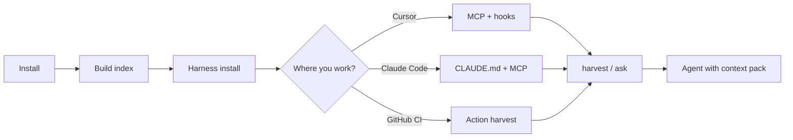
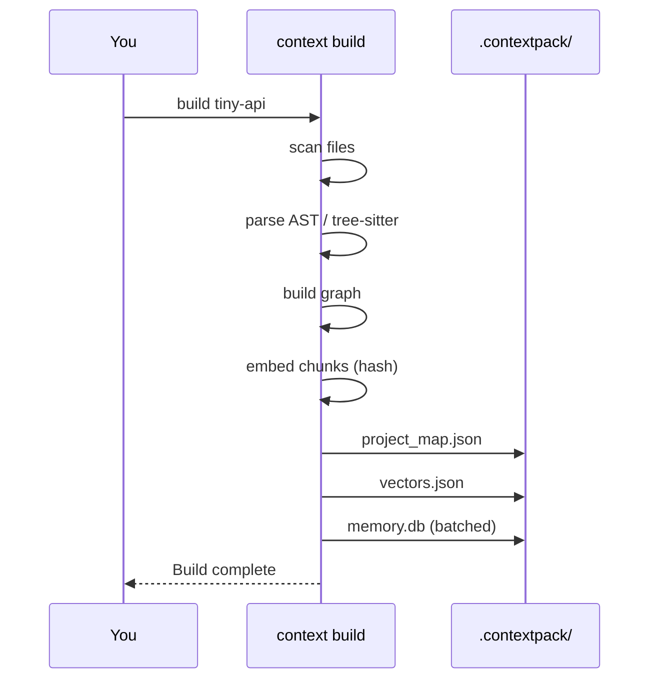
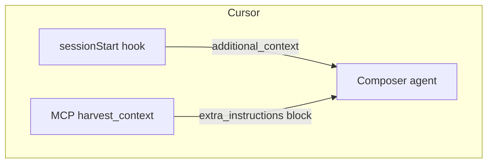
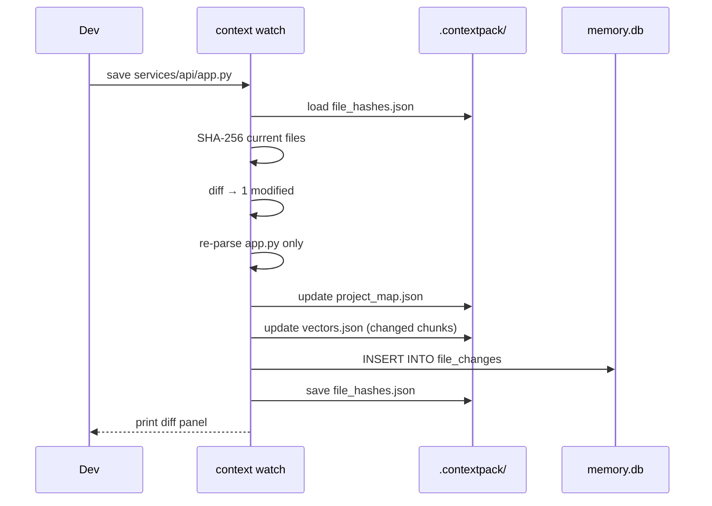
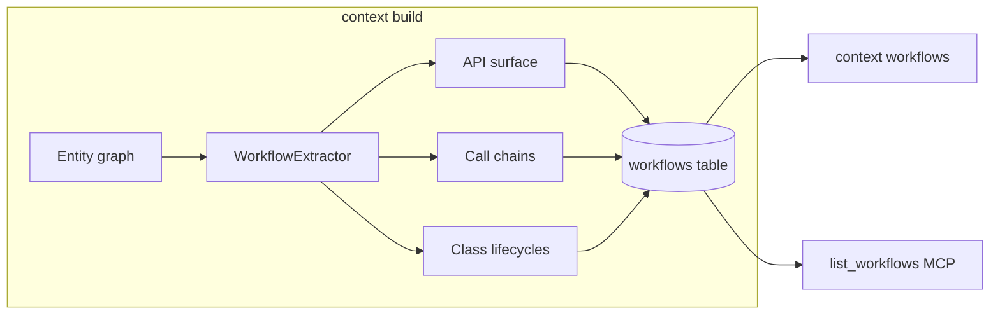

# Context Harness — user journey

A visual walkthrough: from zero to an agent that sees your code **and** your team rules.

Use the **tiny-api** demo (`demo/tiny-api/`) so builds finish in seconds, then apply the same steps to your real repo.

---

## Journey map



---

## Phase 0 — Why does `.contextpack/` feel slow?

`context build` creates several artifacts, not only `memory.db`:

| Artifact | What it is | Typical cost |
|----------|------------|--------------|
| `project_map.json` | Scan + parse all source files | Grows with repo size |
| `vectors.json` | Embeddings for hybrid search | One batch (hash = local, fast) |
| `memory.db` | SQLite entity store | **Was slow:** one DB open per entity; **now batched** |
| `config.json` | Git HEAD stamp for staleness | Instant |

**Large repos (e.g. contextharness itself):** parsing ~100 Python files + ~240 entities dominates; expect a few seconds, not minutes.

**If build takes minutes:**

1. Confirm you are **not** using Chroma unless needed: `CONTEXTPACK_VECTOR_STORE=sqlite` (default).
2. Avoid `uv sync --extra chroma` on first run (ONNX cold start).
3. Run with timings: `context build . --timing`
4. Use a small demo first: `context build demo/tiny-api --timing`

See [Build performance](../docs/guides/build-performance.md).

---

## Phase 1 — Install (once per machine)

```bash
git clone https://github.com/NANDISHSHAH/contextharness.git
cd contextharness
uv sync --extra harness
```

| Tool | Command | Purpose |
|------|---------|---------|
| Runtime | `uv sync` | ContextPack + CLI |
| MCP | `--extra harness` | `context-harness-mcp` for Cursor/Claude |

---

## Phase 2 — Build index (per repo)

```bash
./demo/scripts/demo-02-build.sh
```

Equivalent:

```bash
context init demo/tiny-api
context build demo/tiny-api --timing
```



---

## Phase 3 — Install harness (workflow layer)

```bash
./demo/scripts/demo-01-setup.sh
```

Adds to the target repo:

- `.cursor/hooks.json` — session orientation + stop validation
- `.mcp.json` — MCP server config
- `AGENTS.md` — conventions for harvest

---

## Phase 4 — Get context to an LLM

### Option A — Cursor (recommended)

1. Open `contextharness` or `demo/tiny-api` in Cursor.
2. Enable MCP server **context-harness** (from `.mcp.json`).
3. New chat → session hook injects orientation.
4. Ask: *Use `harvest_context` for: review auth and billing*



### Option B — Claude Code / Claude Desktop

1. Copy or symlink `.mcp.json` into the project (or add server in Claude settings).
2. Add `CLAUDE.md` (use `AGENTS.md` as source).
3. Run build + harvest in terminal; paste output, or use MCP tools.

Detailed steps: [Claude integration](../docs/guides/claude-integration.md).

### Option C — GitHub Actions (PR bot)

On each PR: `context build` → `context harvest` → post comment or pass to API.

Detailed steps: [GitHub integration](../docs/guides/github-integration.md).

---

## Phase 5 — Harvest (task-specific pack)

```bash
./demo/scripts/demo-03-harvest.sh "review auth and billing"
```

Output is an `<extra_instructions>` block containing:

- Team guidelines (`.pr-review/guidelines.md`)
- Test behaviour names
- Compiled code summaries
- Optional Jira (if configured)

**Pass to Claude manually:**

```bash
context harvest "your task" demo/tiny-api > /tmp/pack.md
# Paste pack.md into Claude as project context
```

**Pass via API:** use `AggregatedAgentContext.extra_instructions` from the Python SDK — see [package usage](../docs/guides/package-usage.md).

---

## Phase 6 — Validate & maintain

```bash
context harness validate demo/tiny-api
context harness orient demo/tiny-api
```

Stop hook (Cursor) reminds you when `AGENTS.md` drifts from graph hubs.

---

## Phase 7 — Incremental builds & change log (Phase 3)

Keep the index fresh during active coding without waiting for a full rebuild.

```bash
# Start the watcher — incremental rebuilds on every save
context watch demo/tiny-api
```

Each save triggers a diff, re-parses only the changed file, and prints a panel:

```
╭── incremental build  (0.11s) ───────────────────────────────╮
│ Changes ([a1b2c3d] 1 modified):                              │
│   ~ services/api/app.py  [~2 entities]                       │
│ 12 entities total | 3 re-embedded                            │
╰──────────────────────────────────────────────────────────────╯
```

View the change log any time:

```bash
context changes demo/tiny-api
```



**SDK:**

```python
pmap, stats, changeset = await project.incremental_build()
print(changeset.summary)       # "[a1b2c3d] 1 modified"
rows = await project.recent_changes(limit=10)
```

Full guide: [Incremental builds & change tracking](../docs/guides/incremental-builds.md)

---

## Phase 8 — Workflows & multi-agent memory (Phase 5)

Every `context build` now also extracts workflows and makes multi-agent shared memory available.

### Workflows

```bash
context build demo/tiny-api      # extraction runs automatically
context workflows demo/tiny-api  # list what was found
```

Sample output:

```
api_surface::app
  API routes in app (2 endpoints)
  get_current_user → list_invoices_for_user

call_chain::get_current_user
  Call chain from get_current_user (2 steps)
  get_current_user → fetch_invoices
```

**In Cursor via MCP:**

```
Use list_workflows to show the flows in this codebase
```



### Multi-agent memory

Agents can share decisions and constraints across sessions — no more repeating the same analysis:

```python
# Reviewer agent stores what it found
reviewer = project.agent_memory("reviewer")
await reviewer.store_decision("Auth uses JWT — avoid session cookies")
await reviewer.store_constraint("Never expose raw user IDs")

# Fixer agent reads it before acting
shared = project.shared_memory()
block = await shared.format_for_prompt(query="auth")
# → "## Shared agent memory\n- [reviewer/decision] Auth uses JWT..."
```

**In Cursor via MCP:**

```
Use agent_memory_store with content "Decided: use dependency injection" and fact_type "decision"
Use agent_memory_recall with query "auth" to see what other agents found
```

Full guide: [Workflows & multi-agent memory](../docs/guides/workflows-agent-memory.md)

---

## Cheat sheet

| Goal | Command |
|------|---------|
| Fast learning | `context build demo/tiny-api --timing` |
| Active coding | `context watch demo/tiny-api` |
| View changes | `context changes demo/tiny-api` |
| View workflows | `context workflows demo/tiny-api` |
| Cursor session | hooks auto + MCP `project_outline` |
| Claude paste | `context harvest "…" . > pack.md` |
| PR review | `context harvest "functional review" . --branch feat/x` |
| Check docs | `context harness validate .` |

---

## Next

- [tiny-api README](tiny-api/README.md)
- [Incremental builds](../docs/guides/incremental-builds.md)
- [Workflows & agent memory](../docs/guides/workflows-agent-memory.md)
- [Build performance](../docs/guides/build-performance.md)
- [Claude](../docs/guides/claude-integration.md) · [GitHub](../docs/guides/github-integration.md)
