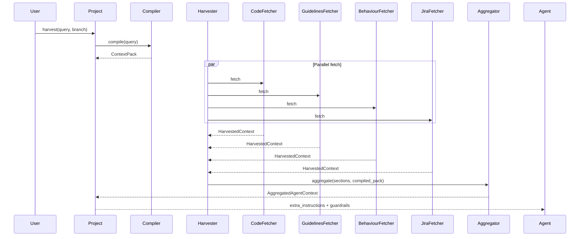

# Context harvester & aggregator

## Purpose

Modern agents fail when they only see **code**. Production workflows also require:

- **Product intent** — what the ticket asked for
- **Product behaviour** — what tests say the system must do
- **Product context** — team rules and glossaries

The **Context Harvester** runs these sources **in parallel** (asyncio). The **Context Aggregator** merges them into a single agent-facing document.

This mirrors domain-aware PR review systems:

```text
Git event → Harvester → Aggregator → LLM → Review comment
```

ContextPack generalizes that pattern for **any** agent task (not only PRs).

---

## Architecture diagram



---

## Fetcher catalogue

### CodeContextFetcher (`code`)

**Analogue:** Graph / AST analysis on changed scope.

**Provides:**

- Repository languages and frameworks
- Graph neighbourhood for query-related symbols
- Top entities with dependency hints

**Requires:** `context build` completed.

---

### ProductGuidelinesFetcher (`product_guidelines`)

**Analogue:** Product Skill / team rules file.

**Search paths (first match wins):**

1. `.pr-review/guidelines.md`
2. `.contextpack/guidelines.md`
3. `docs/CONTRIBUTING.md`
4. `AGENTS.md`
5. `CLAUDE.md`

**Limit:** `CONTEXTPACK_GUIDELINES_MAX_CHARS` (default 12,000).

**If missing:** section skipped; guardrail explains convention checks are disabled.

---

### TestBehaviourFetcher (`product_behaviour`)

**Analogue:** Test suite as behavioural specification.

**Extracts:**

- Python `def test_*`
- JS/TS `it('...')` / `test('...')` / `describe('...')`

**If no tests found:** section skipped with guardrail.

---

### JiraIntentFetcher (`product_intent`)

**Analogue:** Ticket AC and description from issue tracker.

**Activation:** `JIRA_BASE_URL`, `JIRA_EMAIL`, `JIRA_API_TOKEN` configured.

**Ticket detection:** regex `[A-Z][A-Z0-9]+-\d+` in `branch_name` or query.

**If unavailable:** skipped — PR functional alignment checks must not assume AC present.

---

## Aggregator output format

`ContextAggregator` produces `AggregatedAgentContext`:

```xml
<extra_instructions>
# Agent Context Pack
**User query:** ...

## Product Intent (Jira)
...

## Product Context (Team Guidelines)
...

## Product Behaviour (Tests)
...

## Code Context
...

## Compiled Code Memory
- [class] AuthMiddleware ...
</extra_instructions>
```

**Section order** is fixed (intent → guidelines → behaviour → code) so models learn stable structure across runs.

---

## Guardrails

`_build_guardrails()` surfaces operational honesty:

| Condition | Guardrail message |
|-----------|-------------------|
| Jira skipped | Verify branch links to ticket |
| Guidelines missing | Domain convention checks skipped |
| Tests missing | Behavioural consistency limited |

This prevents the illusion of “full product-aware review” when sources were absent.

---

## Extension: custom fetcher

```python
from contextpack.core.models import ContextSourceType, HarvestedContext, ProjectMap
from contextpack.harvester.harvester import ContextHarvester

class SlackIntentFetcher:
    source_type = ContextSourceType.PRODUCT_INTENT

    async def fetch(self, query: str, project_map: ProjectMap) -> HarvestedContext:
        ...

harvester = ContextHarvester(fetchers=[
    CodeContextFetcher(),
    ProductGuidelinesFetcher(),
    SlackIntentFetcher(),
])
```

---

## Related

- [Data flows](data-flow.md)
- [Agent integration](../guides/agent-integration.md)
