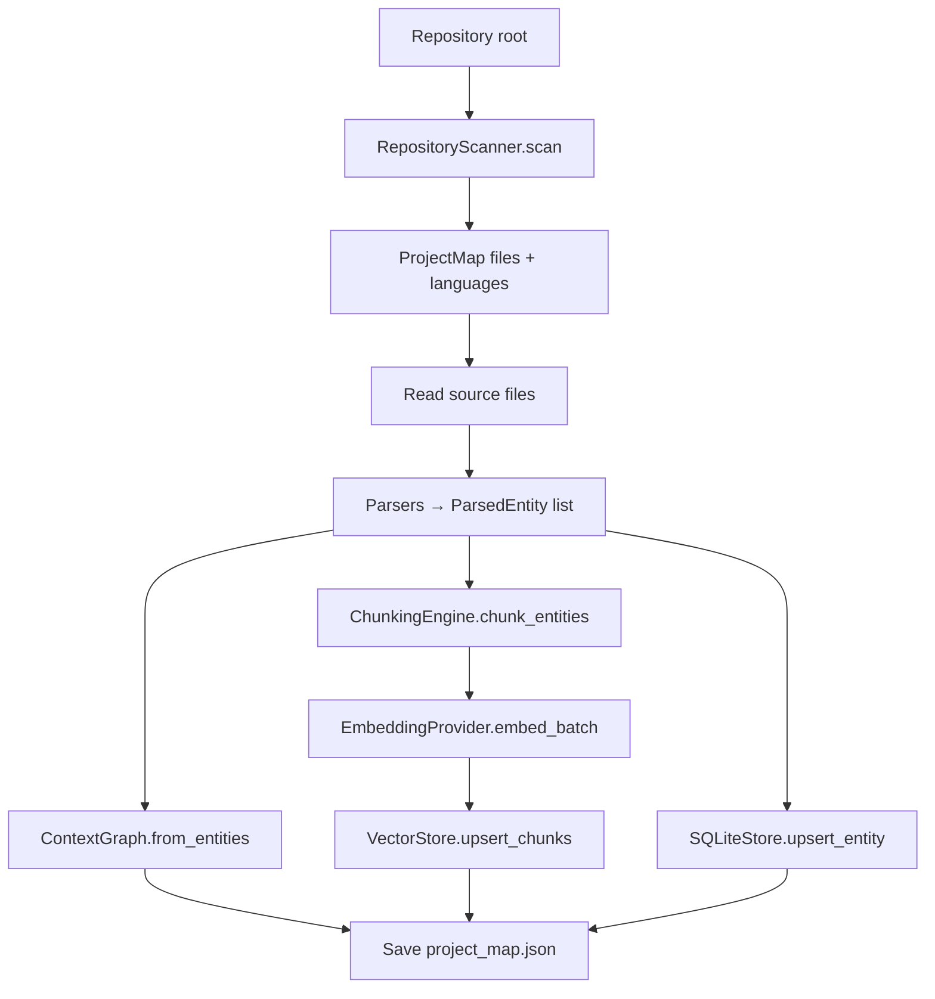
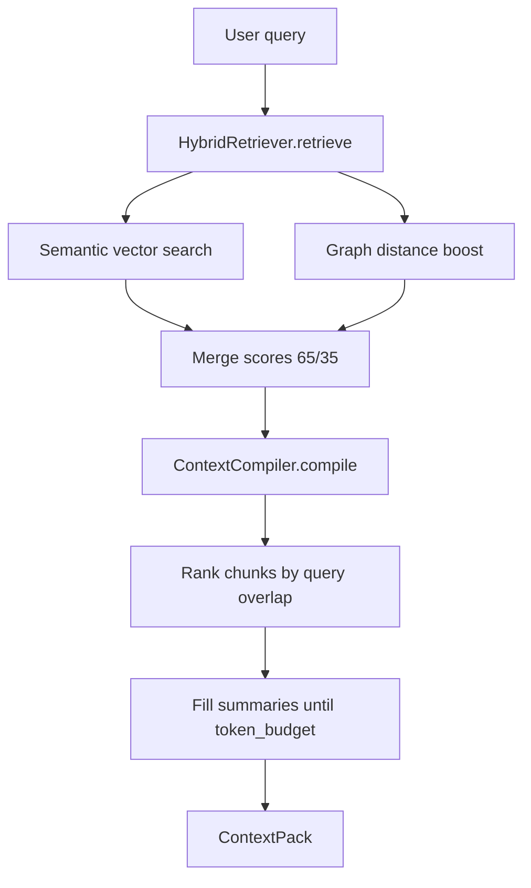
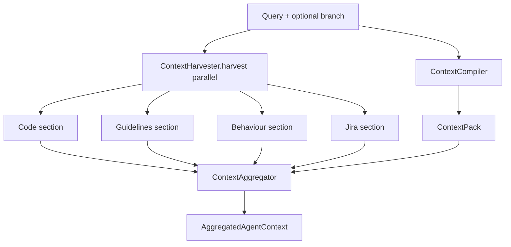
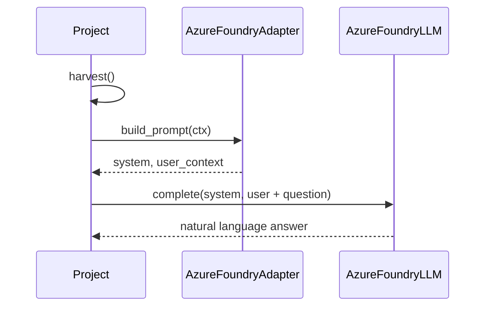
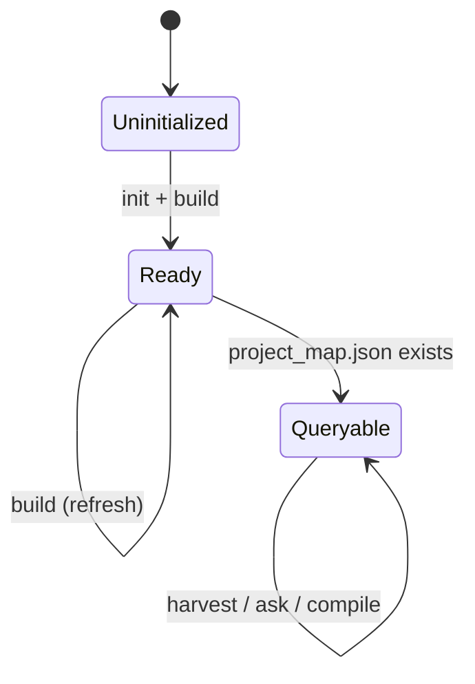

# Data flows

## Flow 1 — `context build` (indexing)

**Goal:** Convert repository → durable project memory.



**Outputs:**

- `ProjectMap` with entities attached
- Vector index (default: `.contextpack/vectors.json`)
- SQLite entity rows
- In-memory graph used on subsequent loads

**Complexity drivers:** repository size, parser languages, embedding provider latency.

---

## Flow 2 — `context compile` (query-scoped pack)

**Goal:** Given a query, produce token-bounded `ContextPack`.



**Hybrid scoring (MVP):**

- `0.65` — semantic rank position
- `0.35` — graph proximity to query-matched nodes

---

## Flow 3 — `context harvest` (complete agent context)

**Goal:** Code memory + product sources → `AggregatedAgentContext`.



---

## Flow 4 — `context ask` (answer)

### Offline mode (default)

```text
harvest → format extra_instructions → template answer + architectural bullets
```

No LLM credentials required. Useful for CI smoke tests and inspecting context quality.

### LLM mode (`--llm` / `use_llm=True`)



---

## Flow 5 — `context watch` (incremental)

```text
watchdog event → debounce 2s → Project.build() full rebuild
```

Phase 3 will introduce true incremental diff indexing; MVP rebuilds for correctness.

---

## State diagram: project readiness



Loading an existing repo: `Project` reads `project_map.json` and reconstructs graph + retriever without re-parse if map exists.

---

## Error & degradation paths

| Failure | Behaviour |
|---------|-----------|
| Parser error on file | Skip file; continue build |
| Fetcher exception | `available=false`, logged warning |
| Jira 401/404 | Skip intent section + guardrail |
| LLM misconfiguration | `ask_llm` raises clear ValueError |
| Missing build | RuntimeError: run build first |

---

## Related

- [System overview](overview.md)
- [Getting started](../guides/getting-started.md)
