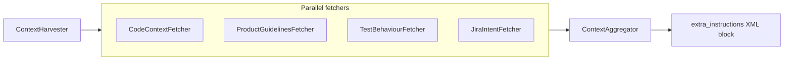

# Design principles

These principles guide every architectural decision in ContextPack. They are the “why” behind the module boundaries.

---

## 1. Everything is context

All inputs become **structured, machine-readable context**:

| Source | Structured as |
|--------|----------------|
| Source code | `ParsedEntity`, graph nodes |
| Docstrings / comments | Symbol summaries |
| Imports | Graph edges (`imports`, `depends_on`) |
| HTTP routes | `EntityType.ROUTE` chunks |
| Guidelines markdown | `HarvestedContext` section |
| Tests | Behaviour list from test names |
| Jira tickets | Product intent section |
| Git branch name | Ticket id extraction (optional) |

**Implication:** avoid ad-hoc string concatenation in agents; pass `AggregatedAgentContext` or `ContextPack`.

---

## 2. Graph-native architecture

Software is relational. ContextPack models it explicitly with `networkx.DiGraph`:

```text
file::auth.py
    └── defines → AuthMiddleware
            ├── imports → oauthlib...
            └── depends_on → SessionStore
```

Hybrid retrieval uses **graph distance** alongside vector similarity so answers follow dependency chains, not just lexical overlap.

**Implication:** invest in parsers and `ContextGraph` before larger embedding models.

---

## 3. Context compression is core

The **`ContextCompiler`** is the product differentiator:

- Input: natural language query + token budget
- Output: `ContextPack` with ranked summaries, key files, graph excerpt

Compression strategies (MVP):

- Top-k hybrid retrieval
- Query-term overlap ranking
- Hard token ceiling via `estimate_tokens`

**Implication:** never send whole repos to the LLM by default.

---

## 4. AI runtime agnostic

Adapters translate the same pack to:

- Claude message shape
- OpenAI chat JSON
- Cursor `extra_instructions`
- LangGraph state dict
- Azure Foundry system/user split

LLM calls go through `LLMProvider`, not scattered SDK usage.

**Implication:** new providers = new adapter + optional LLM class, not fork the pipeline.

---

## 5. Complete context for agents (multi-source)

Inspired by **domain-aware PR review** architectures:



**Graceful degradation:** missing Jira or guidelines → `available=false` + `guardrails` note — never silent failure.

---

## 6. Strong typing & clean modules

- Pydantic v2 for all boundary models
- Protocols for providers
- No circular imports: `Project` orchestrates; leaf modules stay focused

---

## 7. Async-first I/O

Embedding batches, retrieval, harvest, and LLM calls are `async` so agents can run concurrent fetchers and I/O-bound work efficiently.

---

## 8. Modular providers

| Concern | Swappable via env / injection |
|---------|-------------------------------|
| Embeddings | `hash`, `openai`, `azure_foundry` |
| Vectors | `sqlite`, `chroma` |
| LLM | `azure_foundry`, `openai` |
| Fetchers | Custom `ContextFetcher` list on `ContextHarvester` |

---

## 9. Local-first, cloud-ready

Default path works **without API keys** (hash embeddings, offline `ask`). Enterprise path enables Azure Foundry for chat and embeddings in the same compliance boundary.

---

## 10. Inspectability over magic

- `.contextpack/project_map.json` — human-readable index
- `context harvest` — prints full `extra_instructions`
- Guardrails list — explicit about skipped checks

---

## Anti-patterns we avoid

| Anti-pattern | Our response |
|--------------|--------------|
| Mega-prompt with whole repo | Compiler + budget |
| RAG-only scoring | Hybrid graph + semantic |
| Hard-coded OpenAI | Azure Foundry + adapters |
| Silent missing guidelines | Aggregator guardrails |
| Import-time Chroma load | Lazy vector backend |

---

## Related

- [System overview](overview.md)
- [Context harvester](context-harvester.md)
- [Vision & benefits](../product/vision-and-benefits.md)
