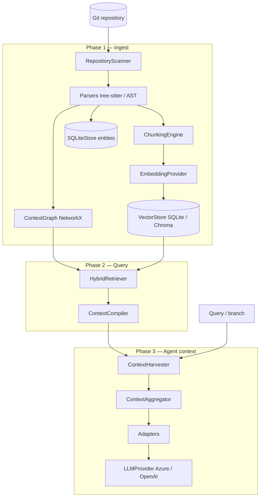

# System architecture overview

## Logical architecture

ContextPack is organized as a **pipeline runtime** with three macro phases:

1. **Ingest & understand** — turn a repository into structured memory
2. **Retrieve & compile** — select what matters for a query under a token budget
3. **Harvest & deliver** — merge code memory with product sources; format for agents



---

## Repository layout (code map)

```text
contextpack/
├── cli/                 Typer CLI (init, build, ask, harvest, graph, watch)
├── core/                Models, config, Project orchestration
├── scanner/             File walk, language detection, framework hints
├── parsers/             Python, TypeScript, JavaScript
├── graph/               ContextGraph — nodes, edges, neighbourhood
├── compiler/
│   ├── chunking/        Semantic chunks (module, class, function, route)
│   └── compiler.py      Token-budgeted ContextPack
├── embeddings/          Providers + vector stores
├── retrieval/           Hybrid semantic + graph scoring
├── harvester/           Parallel context fetchers
├── aggregator/          extra_instructions merger
├── adapters/            Claude, OpenAI, Cursor, LangGraph, Azure Foundry
├── llm/                 Azure Foundry & direct OpenAI completion
├── storage/             SQLite persistence
└── watch/               Filesystem rebuild (watchdog)
```

---

## Runtime artifacts on disk

After `context build`, each repo contains:

```text
.contextpack/
├── config.json           # runtime metadata
├── project_map.json      # files, languages, entities, frameworks
├── memory.db             # SQLite: entities, relationships, summaries
├── vectors.json          # default fast vector index (SQLite backend)
└── chroma/               # optional Chroma persistence
```

These artifacts make context **durable** and **inspectable** — critical for enterprise debugging (“what did the agent see?”).

---

## Core domain models

Defined in `contextpack/core/models.py`:

| Model | Role |
|-------|------|
| `ProjectMap` | Scan result: files, languages, entities |
| `ParsedEntity` | Symbol: class, function, route, imports, docstring |
| `Relationship` | Graph edge with type and weight |
| `SemanticChunk` | Embedding-ready unit with summary |
| `ContextPack` | Compiler output: ranked summaries, files, graph excerpt |
| `HarvestedContext` | One fetcher’s section (code, guidelines, …) |
| `AggregatedAgentContext` | Full agent payload + guardrails |

---

## Interface boundaries (protocols)

`contextpack/core/protocols.py` defines swappable contracts:

| Protocol | Implementations |
|----------|-----------------|
| `Parser` | PythonParser, TypeScriptParser, JSParser |
| `EmbeddingProvider` | Hash, OpenAI, Azure Foundry |
| `VectorStore` | SQLiteVectorStore, ChromaVectorStore (lazy) |
| `ContextFetcher` | Code, Guidelines, Behaviour, Jira |
| `LLMProvider` | AzureFoundryLLM, OpenAIDirectLLM |
| `Retriever` | HybridRetriever |

**Design rule:** orchestration (`Project`) depends on protocols, not concrete vendors.

---

## Deployment patterns

### Local developer

```text
Developer laptop → context build → context ask / IDE adapter
```

### CI / PR agent

```text
GitLab/GitHub webhook → context build (cached) → harvest(branch) → LLM → post comment
```

### Enterprise Azure

```text
Agent runner in VNet → ContextPack → Azure Foundry deployment (private endpoint)
```

No requirement for traffic to public OpenAI if embeddings and chat use Azure deployments.

---

## Cross-cutting concerns

| Concern | Implementation |
|---------|----------------|
| Logging | `structlog` (observability module) |
| Config | `pydantic-settings` + `.env` |
| Async | `asyncio` for embed, retrieve, compile, harvest |
| Typing | Pydantic models + mypy strict target |
| Performance | Lazy imports; SQLite vectors default; Chroma optional |

---

## Related

- [Design principles](design-principles.md)
- [Data flows](data-flow.md)
- [Context harvester](context-harvester.md)
- [Module reference](../reference/modules.md)
