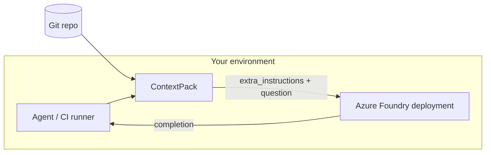

# Azure AI Foundry integration

## Why Azure Foundry (not direct OpenAI)

Enterprise teams deploy models through **Azure AI Foundry** (or Azure OpenAI) to keep:

- Data residency and private networking
- Unified billing and IAM
- Model catalog governance (versioned deployments)

ContextPack targets your **deployment endpoint** — URLs and keys from Foundry — **not** `https://api.openai.com`.

---

## Where to find credentials

In [Azure AI Foundry](https://ai.azure.com):

1. Open your **project**
2. Go to **Deployments** (or Endpoints)
3. Select your chat model deployment
4. Copy:
   - **Endpoint** → `AZURE_OPENAI_ENDPOINT`
   - **Key** → `AZURE_OPENAI_API_KEY`
   - **Deployment name** → `AZURE_OPENAI_DEPLOYMENT`

For embeddings, create a separate embedding deployment → `AZURE_OPENAI_EMBEDDING_DEPLOYMENT`.

---

## Configuration

```env
CONTEXTPACK_LLM_PROVIDER=azure_foundry

AZURE_OPENAI_ENDPOINT=https://YOUR-RESOURCE.openai.azure.com/
AZURE_OPENAI_API_KEY=your-key
AZURE_OPENAI_DEPLOYMENT=gpt-4o
AZURE_OPENAI_API_VERSION=2024-10-21

# Recommended for production retrieval quality
CONTEXTPACK_EMBEDDING_PROVIDER=azure_foundry
AZURE_OPENAI_EMBEDDING_DEPLOYMENT=text-embedding-3-small
```

---

## Architecture placement



ContextPack does **not** host models — it prepares context and calls your deployment via `AzureFoundryLLM` (`AsyncAzureOpenAI`).

---

## SDK usage

```python
from contextpack import Project
from contextpack.llm import AzureFoundryLLM
from contextpack.adapters import AzureFoundryAdapter

project = Project("./repo")
await project.build()

ctx = await project.harvest("How does auth work?")
system, user = AzureFoundryAdapter().build_prompt(ctx)

llm = AzureFoundryLLM()
answer = await llm.complete(
    system,
    f"{user}\n\n**Question:** How does auth work?",
)
```

One-liner:

```python
answer = await project.ask("How does auth work?", use_llm=True)
```

---

## CLI

```bash
context build ./repo
context ask "Explain authentication" ./repo --llm
```

---

## Inference endpoint variant

Some Foundry projects expose an OpenAI-compatible **Model Inference** base URL (`*.services.ai.azure.com`) instead of the classic `*.openai.azure.com` host.

```env
AZURE_USE_INFERENCE_ENDPOINT=true
AZURE_AI_INFERENCE_ENDPOINT=https://YOUR-PROJECT.services.ai.azure.com
AZURE_OPENAI_DEPLOYMENT=your-deployment
```

Implementation uses `AsyncOpenAI` with `base_url` override — still not the public OpenAI API.

---

## Security checklist

| Practice | Recommendation |
|----------|----------------|
| Secrets | Store keys in Azure Key Vault; inject at runtime |
| Network | Private endpoint for Foundry resource |
| Logging | Log query + pack hash, not full source if policy requires |
| Data | `.contextpack/` may contain code summaries — treat as confidential |

---

## Runnable example

[`examples/02_azure_foundry_agent.py`](../../examples/02_azure_foundry_agent.py)

---

## Related

- [Configuration reference](../reference/configuration.md)
- [Agent integration](agent-integration.md)
