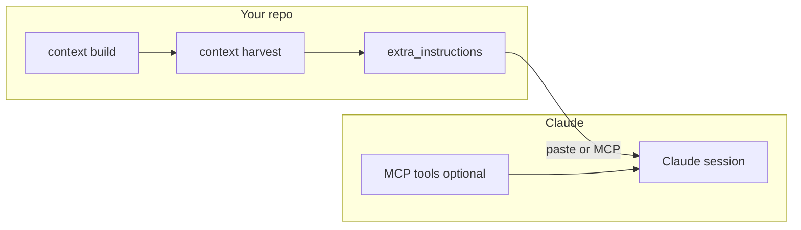

# Claude integration

How to connect Context Harness to **Claude Code**, **Claude Desktop**, or the **Anthropic API** with compiled context.

## Architecture



## Path 1 — MCP (best UX)

Same server as Cursor. In project root `.mcp.json`:

```json
{
  "mcpServers": {
    "context-harness": {
      "command": "uv",
      "args": ["run", "--extra", "harness", "context-harness-mcp"],
      "env": { "CONTEXTPACK_ROOT": "${workspaceFolder}" }
    }
  }
}
```

**Prerequisites:**

```bash
uv sync --extra harness
context build .
```

**Claude tools to use:**

| MCP tool | When |
|----------|------|
| `project_outline` | Start of session |
| `harvest_context` | Before implementing a feature |
| `find_symbol` / `graph_neighbours` | Impact analysis |
| `compile_context` | Code-only, smaller pack |

Add **CLAUDE.md** at repo root (copy from `AGENTS.md` or run `context harness install`).

## Path 2 — Paste harvested context

No MCP required.

```bash
context build .
context harvest "Explain authentication and billing" . > /tmp/context-pack.md
```

In Claude:

1. Attach or paste `/tmp/context-pack.md` as project context.
2. Ask your task in the same thread.

The pack includes guidelines, test behaviour, and ranked code summaries.

## Path 3 — Anthropic API (automation)

```python
import asyncio
from contextpack import Project
from contextpack.adapters import ClaudeAdapter

async def main():
    project = Project("./my-repo")
    await project.init()
    await project.build()
    ctx = await project.harvest("Review refund flow")
    system, user = ClaudeAdapter().build_prompt(ctx)
    # Send system + user to messages API

asyncio.run(main())
```

Set `ANTHROPIC_API_KEY` in `.env` when calling the API yourself.

## Path 4 — Claude Code CLI

```bash
cd my-repo
context build .
context harness install .
# Ensure CLAUDE.md exists (from AGENTS.md template)
claude  # in repo root; MCP from .mcp.json if supported in your Claude Code version
```

## Recommended workflow

```text
1. context build .              # after pull or large refactor
2. harvest_context (MCP)        # per task
3. Implement with Claude
4. context harness validate .   # optional doc drift check
```

## Demo

```bash
cd contextharness
./demo/scripts/demo-02-build.sh
./demo/scripts/demo-03-harvest.sh "review auth and billing"
```

## Related

- [User journey](../../demo/USER-JOURNEY.md)
- [Agent integration](agent-integration.md)
