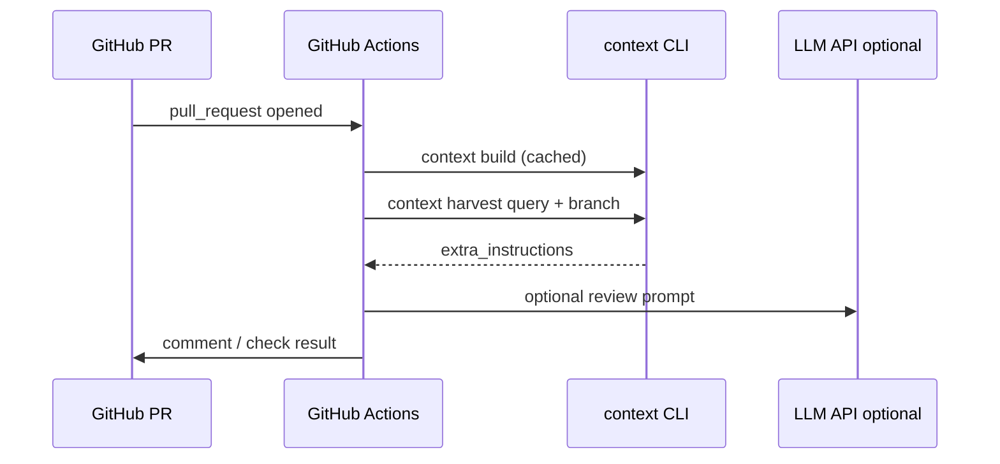

# GitHub integration

Use Context Harness in **GitHub Actions** for PR comments, checks, or agent workflows.

## Flow



## Minimal workflow

Add `.github/workflows/context-harness.yml`:

```yaml
name: Context Harness

on:
  pull_request:
    branches: [main]

jobs:
  context:
    runs-on: ubuntu-latest
    steps:
      - uses: actions/checkout@v4

      - uses: astral-sh/setup-uv@v5
        with:
          enable-cache: true

      - name: Install ContextPack
        run: |
          cd path/to/contextharness  # or pip install contextpack from PyPI when published
          uv sync

      - name: Build index
        run: uv run context build ${{ github.workspace }}

      - name: Harvest PR context
        run: |
          uv run context harvest \
            "functional review of changes" \
            ${{ github.workspace }} \
            --branch "${{ github.head_ref }}" \
            > context-pack.md

      - name: Upload context artifact
        uses: actions/upload-artifact@v4
        with:
          name: agent-context-pack
          path: context-pack.md
```

Download `context-pack.md` from the Actions run and paste into Claude, or wire to an LLM step.

## Cache `.contextpack` (optional)

```yaml
      - uses: actions/cache@v4
        with:
          path: .contextpack
          key: contextpack-${{ runner.os }}-${{ hashFiles('**/*.py') }}
```

Invalidate when source changes; saves parse/embed time on large repos.

## PR comment (outline)

Use `gh pr comment` after harvest:

```yaml
      - name: Post summary
        env:
          GH_TOKEN: ${{ github.token }}
        run: |
          echo "Context pack generated ($(wc -c < context-pack.md) bytes)." \
            | gh pr comment ${{ github.event.pull_request.number }} --body-file -
```

For full LLM review, add a step that calls Azure/OpenAI with `context-pack.md` as system context (see [Azure Foundry](azure-foundry.md)).

## Use demo repo in CI smoke test

```yaml
      - name: Demo smoke
        run: |
          uv run context build demo/tiny-api --timing
          uv run context harness validate demo/tiny-api
```

## Secrets

| Secret | Purpose |
|--------|---------|
| `JIRA_*` | Product intent in harvest |
| `AZURE_OPENAI_*` | LLM review step |
| `OPENAI_API_KEY` | Alternative LLM |

Not required for build/harvest-only artifacts.

## Related

- [User journey](../../demo/USER-JOURNEY.md)
- [Use cases — PR review](../product/use-cases.md)
