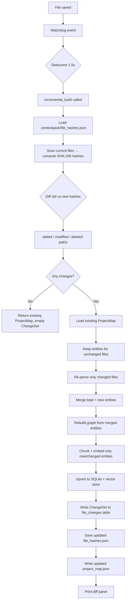

# Incremental builds & change tracking (Phase 3)

ContextPack Phase 3 adds three related capabilities on top of the existing full build:

| Capability | What it does |
|------------|--------------|
| **Incremental build** | Re-parses only files whose content changed; patches the entity list, graph, and embeddings in-place |
| **File-hash change log** | Every incremental run records which files changed (added / modified / deleted), which entities shifted, and the current git commit |
| **Smart watch mode** | `context watch` now calls `incremental_build()` on each save instead of discarding and rebuilding everything |

---

## Why this matters

A full `context build` on a 200-file repo takes a few seconds. On a 2000-file monorepo it can take tens of seconds. Every time you save a file during an active session you don't want to wait for the full pipeline. Incremental builds make the turnaround feel instant — only the changed files re-run through parse → graph → embed.

The change log is also useful for agents: instead of asking "what does this code do?", an agent can ask "what changed since the last build?" and get a precise, structured answer.

---

## Quick start

### Automatic (watch mode)

```bash
context build ./my-repo           # full build + saves baseline hashes
context watch ./my-repo           # watches for changes, rebuilds incrementally
```

Each time you save a source file you'll see a panel like:

```
╭── incremental build  (0.14s) ───────────────────────────────╮
│ Changes ([a1b2c3d] 1 modified):                              │
│   ~ services/api/app.py  [~2 entities]                       │
│ 142 entities total | 4 re-embedded                           │
╰──────────────────────────────────────────────────────────────╯
```

### Manual (Python SDK)

```python
import asyncio
from contextpack import Project

async def main():
    project = Project("./my-repo")

    # First run: falls back to full build, saves baseline hashes
    pmap, stats, changeset = await project.incremental_build()
    print(changeset.summary)          # "initial build (no prior snapshot)"

    # After editing a file:
    pmap, stats, changeset = await project.incremental_build()
    print(changeset.summary)          # "[a1b2c3d] 1 modified"
    for fc in changeset.files_changed:
        print(f"{fc.change_type:10} {fc.path}")
        print(f"  added:    {fc.entities_added}")
        print(f"  removed:  {fc.entities_removed}")
        print(f"  modified: {fc.entities_modified}")

asyncio.run(main())
```

---

## Viewing the change log

### CLI

```bash
context changes ./my-repo            # last 30 changes
context changes ./my-repo --limit 10 # last 10
```

Sample output:

```
 Build     Type       File                              Commit
 ───────── ────────── ──────────────────────────────── ──────────
 a1b2c3d   modified   services/api/app.py               abc1234
 a1b2c3d   added      services/billing/reports.py       abc1234
 9x8y7z6   deleted    packages/core/legacy.py           bcd5678
```

### MCP tool (Cursor / Claude)

```
Use get_recent_changes to show what changed in the last build
```

### Python SDK

```python
rows = await project.recent_changes(limit=20)
for r in rows:
    print(r["change_type"], r["path"], r["git_commit"])
```

---

## How it works



---

## ChangeSet model

```python
from contextpack.core.models import ChangeSet, FileChange

# ChangeSet fields
changeset.build_id       # short UUID (8 chars)
changeset.timestamp      # Unix timestamp
changeset.git_commit     # short git hash (empty if not a git repo)
changeset.summary        # human-readable: "[abc1234] 2 modified, 1 added"
changeset.files_changed  # list[FileChange]
changeset.total_changes  # int property

# FileChange fields
fc.path             # relative file path
fc.change_type      # "added" | "modified" | "deleted"
fc.old_hash         # SHA-256 of previous content
fc.new_hash         # SHA-256 of current content
fc.timestamp        # when this change was recorded
fc.git_commit       # git HEAD at time of build
fc.entities_added   # entity names newly detected in this file
fc.entities_removed # entity names no longer present
fc.entities_modified # entity names present in both old and new
```

---

## Incremental vs full build

| Scenario | Recommended command |
|----------|---------------------|
| First time on a repo | `context build` |
| Active coding session | `context watch` |
| CI pipeline | `context build` (reproducible) |
| After pulling a branch | `context build` (safe re-baseline) |
| SDK integration in a dev loop | `project.incremental_build()` |

!!! tip
    `context build` always saves fresh hashes. Run it once after cloning or switching branches so the incremental baseline is correct.

---

## Memory module API

The `contextpack.memory` module is the low-level API backing incremental builds. You can use it directly if you need custom delta logic:

```python
from contextpack.memory import (
    load_hashes,        # dict[path → sha256] from file_hashes.json
    save_hashes,        # persist updated hashes
    compute_hashes,     # SHA-256 all listed paths
    diff_hashes,        # (added, modified, deleted) from two hash dicts
    build_changeset,    # assemble a ChangeSet from diffs + entity deltas
    format_changeset,   # human-readable multi-line string
)
```

---

## Related

- [Build performance](build-performance.md)
- [Phase 5: Workflows & agent memory](workflows-agent-memory.md)
- [Example: incremental watch](../../examples/03_incremental_watch.py)
