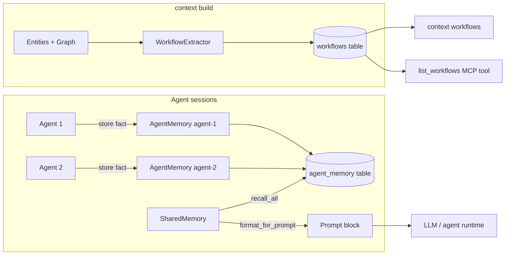

# Workflows & multi-agent memory (Phase 5)

Phase 5 adds two independent capabilities that work together to give agents deeper structural understanding and cross-session state:

| Capability | What it does |
|------------|--------------|
| **WorkflowExtractor** | Detects multi-step flows from the entity graph: API surfaces, call chains, and class lifecycles |
| **AgentMemory / SharedMemory** | SQLite-backed fact store — agents write decisions, observations, and constraints; other agents can read them |

Both run automatically during `context build`. No extra configuration is required.

---

## Workflow extraction

### What gets detected

`WorkflowExtractor` runs three detection strategies on every build:

| Strategy | Detects | Example |
|----------|---------|---------|
| **API surface** | Routes / endpoints grouped by service file | `GET /invoices`, `POST /auth/token` |
| **Call chains** | Entry-point → dependency traversal (depth 5) | `handle_request → validate → fetch_user → fetch_invoices` |
| **Class lifecycles** | Classes with 2+ methods → lifecycle flow | `InvoiceService.__init__ → create → update → delete` |

### CLI

```bash
context build ./my-repo       # extraction runs automatically
context workflows ./my-repo   # list all detected workflows
```

Sample output:

```
Extracted workflows (4)

api_surface::app
  API routes in app (3 endpoints)
  list_invoices_for_user → get_current_user → fetch_invoices

call_chain::handle_request
  Call chain from handle_request (4 steps)
  handle_request → validate_token → get_user → fetch_data

class_lifecycle::InvoiceService
  InvoiceService class with 5 methods
  __init__ → create → read → update → delete
```

### MCP tool (Cursor / Claude)

```
Use list_workflows to show detected flows in this codebase
```

### Python SDK

```python
import asyncio
from contextpack import Project

async def main():
    project = Project("./my-repo")
    await project.build()      # runs extraction + persists to SQLite

    workflows = await project.workflows()
    for wf in workflows:
        print(wf["name"])
        print("  Summary:", wf["summary"])
        print("  Steps:  ", " → ".join(wf.get("steps", [])[:6]))

asyncio.run(main())
```

### Using the extractor directly

```python
from contextpack.workflows import WorkflowExtractor
from contextpack.graph.engine import ContextGraph

graph = ContextGraph.from_entities(entities)
extractor = WorkflowExtractor(graph, entities)
workflows = extractor.extract()

for wf in workflows:
    print(wf.name, "—", wf.summary)
    print("  Steps:", wf.steps)
    print("  Files:", wf.entities)
```

---

## Multi-agent memory

### Concepts

| Class | Scope | Use case |
|-------|-------|----------|
| `AgentMemory` | Per agent | Store decisions/observations made by one agent |
| `SharedMemory` | All agents | Query facts across all agents; inject into prompts |

All facts land in the same `agent_memory` SQLite table. `AgentMemory` writes with a specific `agent_id`; `SharedMemory` reads across all of them.

### Fact types

| Type | Meaning |
|------|---------|
| `observation` | Something noticed about the code |
| `decision` | A choice made ("decided to use X pattern") |
| `constraint` | A rule to follow ("never modify billing.py directly") |
| `task_state` | Current progress on a task |

### CLI via MCP (Cursor / Claude)

```
# Store a fact
Use agent_memory_store with content "Decided: auth uses JWT, not session cookies" and fact_type "decision"

# Recall facts
Use agent_memory_recall with query "auth"

# Recall all facts from a specific agent
Use agent_memory_recall with agent_id "reviewer"
```

### Python SDK — basic

```python
import asyncio
from contextpack import Project

async def main():
    project = Project("./my-repo")

    # Write from one agent
    mem = project.agent_memory("reviewer")
    await mem.store_decision(
        "Auth uses JWT tokens — avoid session-based patterns",
        entity_ids=["services/api/app.py::get_current_user"],
    )
    await mem.store_constraint("Never bypass the token validation middleware")
    await mem.store_observation("Billing service is isolated — no direct DB access from API layer")

    # Read from another agent (or the same one)
    shared = project.shared_memory()
    facts = await shared.recall_all(query="auth")
    for f in facts:
        print(f"[{f['agent_id']}/{f['fact_type']}] {f['content']}")

    # Inject into an agent prompt
    block = await shared.format_for_prompt(query="auth")
    print(block)

asyncio.run(main())
```

### Python SDK — multi-agent pattern

```python
async def review_agent(project: Project, query: str) -> str:
    """Agent 1: reviews code and stores observations."""
    mem = project.agent_memory("review-agent")
    ctx = await project.harvest(query)

    # Store what we found
    await mem.store_observation(f"Reviewed: {query} — auth flow is clean")
    await mem.store_decision("Pattern: use dependency injection for all service calls")
    return ctx.extra_instructions


async def fix_agent(project: Project, query: str) -> str:
    """Agent 2: reads review agent's memory before acting."""
    shared = project.shared_memory()
    prior_context = await shared.format_for_prompt(query=query)

    # prior_context includes decisions and constraints from review-agent
    ctx = await project.harvest(query)
    return prior_context + "\n\n" + ctx.extra_instructions
```

---

## Workflow model

```python
from contextpack.core.models import Workflow, WorkflowStep

# Workflow fields
wf.name        # unique key, e.g. "api_surface::app" or "call_chain::handle_request"
wf.steps       # list[str] — entity names in order
wf.summary     # one-line description
wf.entities    # list[str] — file paths involved

# WorkflowStep (for custom workflows)
step.name        # step label
step.entity_id   # graph node ID
step.file_path   # source file
step.order       # 0-based position in the flow
step.description # optional human description
```

## AgentFact model

```python
from contextpack.core.models import AgentFact

fact.fact_id      # 12-char UUID
fact.agent_id     # who wrote it
fact.fact_type    # "observation" | "decision" | "constraint" | "task_state"
fact.content      # the fact text
fact.entity_ids   # code entities this fact relates to
fact.timestamp    # Unix float
fact.confidence   # 0.0–1.0
fact.metadata     # dict — arbitrary extras
```

---

## Data flow



---

## How workflows feed into context packs

When you call `project.harvest(query)` or `context harvest`, the compiler now also uses workflow information to rank relevant chunks. If your query matches a workflow name or step, those entities are prioritised in the token-budgeted output.

---

## Tips

- Run `context build` whenever code structure changes significantly — workflow extraction is part of the build pipeline, not a separate step.
- For long-running multi-agent sessions, use `SharedMemory.format_for_prompt()` to prepend prior decisions to each new agent call. This prevents agents from repeating work or making conflicting choices.
- Fact confidence defaults to `1.0`. Lower it for uncertain observations: `await mem.store("Possible race condition in billing", confidence=0.6)`.

---

## Related

- [Phase 3: Incremental builds](incremental-builds.md)
- [Context Harness guide](context-harness.md)
- [MCP tools](context-harness.md#mcp-tools)
- [Example: workflows & agent memory](../../examples/04_workflows_agent_memory.py)
